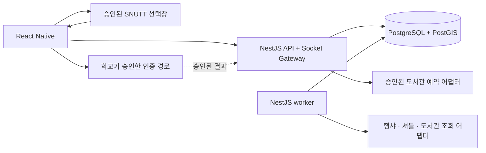

# 외부 서비스 연동 조사와 권고안

**2026-09-27 셔틀 후속 조사:** 학교 공지가 안내한 새 노선도 서비스에서 정상 HTTPS와 차량 표시용 읽기 경로를 확인했다. 아래 DWR 관련 내용은 구형 서비스 관측이며 현재 후보·미검증 범위는 [서울대학교 앱의 정류장 기준 셔틀 정보 조사](shuttle-app-stop-info.md)를 우선한다. 앱 구조와 초기 연동 범위도 후속 사용자 결정이 반영된 [기술 설계](../spec.md)를 따른다.

확인일: 2026-09-26 KST. 사용자 요청에 따라 와플스튜디오의 SNUTT·행샤 공식 저장소와 서울대학교의 도서관·셔틀·SSO 공식 자료를 조사했다. 공개 소스에 구현된 기능, 실제 공개 응답, 이용 조건 미확인 사항을 구분한다. 아래 구조는 채택을 위한 제안이며 연동 승인을 받았다는 뜻은 아니다. 문의·신청·학교 로그인·예약은 실행하지 않았다.

## 판단 요약

| 의존 기능 | 이번에 확인한 구체적인 경로 | 우리 앱의 권고안 | 확보해야 할 조건 |
|---|---|---|---|
| 개인 시간표 | SNUTT의 외부 시간표 선택창과 JSON 전달 코드 | 사용자가 선택한 시간표를 검토 후 가져오기 | origin 등록, Android WebView 동작, 데이터 계약 |
| 행사 | 행샤의 공개 조회 OpenAPI 및 비로그인 운영 GET 성공 | NestJS worker에서 조회·정규화·공유 캐시 | 호출·재표시 조건, 수정/삭제 정책, 포스터 이용 범위 |
| 관정 좌석·공간 예약 | 공식 시설 안내와 사용자용 예약 페이지 | 시설 안내·공식 예약 이동을 먼저 구현하고 승인 API로 확장 | 잔여좌석 조회와 사용자 위임 예약 API를 각각 협의 |
| 교내 순환 셔틀 | 공식 지도 소스에 DWR 차량 좌표 조회 구현 | 승인된 feed를 worker 한 곳에서 수집·중계 | 지원 endpoint, TLS, 갱신 주기, 차량 ID·관측 시각 |
| 서울대 SSO | 기관 대상 공식 연동 신청 절차 | 단순인증 신청 가능성부터 사전 상담 | 학생 팀 자격, 책임 기관, 학교 IP·도메인, 모바일 연동 방식 |

근거와 상세 계약: [SNUTT](snutt-integration.md), [행샤](haengsha-integration.md), [관정·SSO](library-sso-integration.md), [교내 셔틀](shuttle-integration.md).

**현재 스택을 바꿀 이유는 발견하지 못했다.** React Native와 NestJS로 각 경로를 감싸는 설계가 가능하다. 다만 SNUTT의 RN 호환성은 실제 APK에서 확인해야 하고, 학교 SSO가 지원 런타임의 agent 설치를 요구한다면 인증 부분에 별도 브리지가 필요할 수 있다. SSO의 학교 IP·도메인 조건은 서버 배포 위치를 정하기 전에 해소해야 한다.

## SNUTT: API 직접 접근보다 기존 선택창이 우선

공식 웹 클라이언트에는 `/timetable-picker?origin=...` 경로가 있다. SNUTT에서 로그인한 사용자가 시간표 하나를 선택하면 `SNUTT_TIMETABLE_SELECTED` 메시지에 강의·요일·시간·장소를 담아 내보낸다. 웹 popup과 RN WebView 송신 분기가 있고 2026-08-25 릴리스에도 RN 공유 지원이 기록됐다. 허용 origin 설정이 있으므로 우리 주소 등록을 요청해야 한다. [공식 릴리스](https://github.com/wafflestudio/snutt-frontend/releases/tag/snutt-webclient-prod-26.08.25-1), [선택창 진입 검사](https://github.com/wafflestudio/snutt-frontend/blob/9f6674974c3c8171d64b646b49eb6038119e11b7/apps/snutt-webclient/src/pages/timetable-picker/index.tsx#L15-L38)

중요한 정적 분석 결과가 있다. RN bridge가 있어도 확인 화면은 `window.opener`가 없으면 버튼을 비활성화하고 송신을 중단한다. 일반 RN WebView에서 바로 동작한다고 확정할 수 없다. 운영팀에 지원 예제와 배포본 수정 여부를 확인한 뒤 Android에서 로그인·선택·취소·닫기를 검증한다. [화면의 opener 조건](https://github.com/wafflestudio/snutt-frontend/blob/9f6674974c3c8171d64b646b49eb6038119e11b7/apps/snutt-webclient/src/pages/timetable-picker/timetable-picker-content/index.tsx#L59-L100)

우리 구현 흐름은 다음을 권고한다.

```text
앱에서 SNUTT 시간표 가져오기
→ 승인된 선택창에서 사용자 로그인·선택
→ JSON 수신·크기/스키마 검증
→ NestJS에서 일정 초안으로 정규화
→ 사용자가 학기·시간·장소 검토
→ 해당 가져오기 묶음만 교체하고 가용 시간 재계산
```

공유 시 사용자 ID·시간표 ID·수정 시각을 제거하므로 첫 버전은 **다시 가져오는 snapshot**으로 설계한다. 지속 동기화나 계정 연결로 표시하지 않는다. 학기 코드는 `1=봄, 2=여름, 3=가을, 4=겨울`, 요일은 `0=월요일`이므로 변환을 명시한다. 학기 유효 기간과 휴강은 별도로 관리하며 수동 일정·확정 친구 약속을 덮어쓰지 않는다. [공유 변환](https://github.com/wafflestudio/snutt-frontend/blob/9f6674974c3c8171d64b646b49eb6038119e11b7/apps/snutt-webclient/src/usecases/timetablePickerService.ts#L12-L58), [학기 코드](https://github.com/wafflestudio/snutt/blob/bbad28d87c23f7b510a256daaad47ee2a3358a14/core/src/main/kotlin/common/enums/Semester.kt#L9-L18), [요일 코드](https://github.com/wafflestudio/snutt/blob/bbad28d87c23f7b510a256daaad47ee2a3358a14/core/src/main/kotlin/common/enums/DayOfWeek.kt#L9-L21)

SNUTT의 수강편람 검색, 개인 시간표, 학교 인증은 서로 다르다. 사용자가 만든 시간표는 실제 수강신청 내역이 아니며, SNUTT의 학교 메일 코드 인증은 서울대 SSO가 아니다. 승인 전에는 기존 직접 입력·이미지 추출을 병행할 수 있다. [학교 메일 인증 구현](https://github.com/wafflestudio/snutt/blob/bbad28d87c23f7b510a256daaad47ee2a3358a14/core/src/main/kotlin/users/service/UserService.kt#L385-L418)

## 행샤: 공개 조회 API를 행사 공급자로 연결

실제 저장소는 `hangsha-server`, `hangsha-web`이다. 운영 [OpenAPI 문서](https://hangsha-api.wafflestudio.com/openapi.yaml)와 공개 행사 조회가 확인됐다. 하루 목록 1건을 인증 없이 조회해 HTTP 200을 받았다. 이는 해당 요청의 기술적 접근 가능성 확인이며 장기 이용·재배포 계약의 확인은 아니다. [검증한 GET](https://hangsha-api.wafflestudio.com/api/v1/events/day?date=2026-09-26&page=1&size=1)

주요 경로는 `https://hangsha-api.wafflestudio.com/api/v1` 기준이다.

```http
GET /events/month?from=2026-09-26&to=2026-10-03
GET /events/day?date=2026-09-26&page=1&size=20
GET /events/{eventId}
GET /events/search?query=...&page=1&size=20
```

요청은 읽기 계약을 보여 주는 예시이며 반복 수집을 수행한 기록이 아니다. 정확한 파라미터와 버전은 운영팀과 고정한다. [공식 Controller](https://github.com/wafflestudio/hangsha-server/blob/4a33bf96bff8b71f1fb837c779da057e136f7784/hangsha/src/main/kotlin/com/team1/hangsha/event/controller/EventController.kt#L21-L120)

`HangshaEventProvider`가 합의한 기간의 행사를 읽고 `(provider, externalId)`로 저장한다. 사용자별 행샤 로그인은 공개 목록 수집에 필요하지 않다. 우리 쪽 보강은 다음이 핵심이다.

- 신청 기간과 실제 활동 시간을 분리한다. 기간형 행사는 신청 기간으로 월별 목록에 배치되므로 목록 날짜를 그대로 친구 약속 시각으로 쓰지 않는다.
- 장소는 문자열만 제공되므로 학교 건물 사전과 연결한다. 미확인 위치는 검토 대기로 남긴다.
- 공개 DTO에 `updatedAt`·삭제 피드가 없다. 내용 hash와 완전히 성공한 조회 범위를 기록하고 정정·취소를 재확인한다. 연결된 파티는 보존하고 변경 내용을 표시한다.
- 같은 원문에 여러 회차가 있을 수 있어 `applyLink` 하나로 중복 제거하지 않는다.
- 전체 학과 공지를 모두 포괄한다고 가정하지 않는다. 확인된 원천은 비교과관리시스템과 서울대학교 공식 행사 게시판이다.

근거: [공개 DTO](https://github.com/wafflestudio/hangsha-server/blob/4a33bf96bff8b71f1fb837c779da057e136f7784/hangsha/src/main/kotlin/com/team1/hangsha/event/dto/core/EventDto.kt#L6-L35), [날짜 버킷 생성](https://github.com/wafflestudio/hangsha-server/blob/4a33bf96bff8b71f1fb837c779da057e136f7784/hangsha/src/main/kotlin/com/team1/hangsha/event/service/EventService.kt#L67-L102), [회차별 저장](https://github.com/wafflestudio/hangsha-server/blob/4a33bf96bff8b71f1fb837c779da057e136f7784/hangsha/common/src/main/kotlin/com/team1/hangsha/event/service/EventSyncService.kt#L70-L115), [원천·정정 구현 상세](haengsha-integration.md).

행샤 두 저장소에서 명시적 라이선스를 확인하지 못했다. 소스 코드 복사, API 조회·캐시, 원 게시자의 포스터 재표시는 별개의 확인 항목이다. 데이터 연동을 위해 행샤 서버 전체를 복제할 필요는 없다.

## 관정: 잔여좌석 조회와 예약 권한을 따로 확보

공식 시설 화면에서 연결하는 관정 사용자용 진입점은 [시설 예약 페이지](https://k-rsv.snu.ac.kr/NEW_SNU_BOOKING/LibLogin1.jsp)다. 외부 앱용 잔여좌석·위임 예약·취소 API는 공개 자료에서 확인하지 못했다. 학교 SSO를 승인받더라도 예약 권한까지 생기는 것은 아니다.

개인 열람실과 그룹스터디룸의 자원·규칙을 분리해야 한다. 공식 안내상 개인 좌석은 예약 후 30분 이내 키오스크 배정 절차가 있고, 스터디룸은 재학생 대상이며 3일 전부터 최대 3시간 예약한다. **예약 완료와 좌석 배정 완료가 다르다.** [시설별 공식 안내](https://lib.snu.ac.kr/using/places-carrel/places/)

권고하는 단계는 시설 안내·공식 예약 이동 → 승인된 잔여좌석/시간대 조회 → 승인된 위임 예약이다. `LibraryAvailabilityProvider`와 `LibraryBookingProvider`를 분리한다. 예약 쓰기는 사용자 확인 후 실행하고 외부 예약 ID·상태로 성공을 판정한다. Timeout은 `unknown`으로 남겨 재조회하며, 앱 복귀나 자체 요청 ID를 성공 증거로 사용하지 않는다. 외부 API가 확보되기 전에는 챗봇이 실제 예약 완료를 주장하지 않게 한다.

## 셔틀: DWR 조회 구현은 발견, 지원되는 데이터 계약은 미확인

[공식 순환 노선 지도](https://shuttlebus.snu.ac.kr/mobile/route/routeMap.action?bus_route_id=61)의 HTML에 정류장·노선 좌표와 `RouteDWR.selectStationInBusAll(61, callback)` 호출이 있다. 응답의 `bus_latitude`, `bus_longitude`로 차량을 그리며 응답 처리 후 10초 뒤 다시 조회한다. [공개 DWR 인터페이스](https://shuttlebus.snu.ac.kr/dwr/interface/RouteDWR.js)도 확인했다. **실제 DWR 차량 응답은 호출하지 않았으므로 최신 좌표 제공 상태는 미검증이다.**

조사 환경의 일반 HTTPS 요청에서는 인증서 만료 오류가 났다. 공개 소스 확인용으로만 일회성 검증 예외를 사용했으며 운영 연동에는 유효한 TLS endpoint가 필요하다. 공식 화면의 오래된 지도 SDK 구성까지 고려하면 WebView에 넣는 것만으로 해결된다고 보기 어렵다. 상세 관측 범위는 [셔틀 조사](shuttle-integration.md)에 기록했다.

지원되는 feed 또는 해당 DWR 읽기 사용 조건을 확보한 뒤 worker가 노선당 한 번 조회하고 우리 API가 캐시를 제공하도록 권고한다. 안정적인 차량 ID·GPS 관측 시각을 받는지 확인해야 한다. 원본 timestamp가 없으면 수신 시각을 “서버 확인 시각”으로만 표시한다. 서울시 일반 시내버스 API가 교내 셔틀도 제공한다고 가정하지 않는다.

## 서울대 SSO: 공식 신청 제도는 있으나 학생 팀 제공은 별도 협의

정보화본부는 통합인증 연동 서비스를 공식 안내한다. 운영 책임 주체, 학교 IP와 `*.snu.ac.kr`, 담당자 사전 협의, 포털 신청과 전자결재 공문 등이 요구된다. 기관 단위 지원 안내에서 교육기구는 학부/과 단위 이하가 제외되어 있으므로, 담당 교수와 적절한 기관을 통해 학생 수업 프로젝트의 신청 자격을 먼저 확인해야 한다. [공식 SSO 안내](https://ist.snu.ac.kr/%ED%86%B5%ED%95%A9%EC%9D%B8%EC%A6%9D-sso/)

단순인증의 라이선스 비용은 무료로 안내한다. 개인정보 조회를 포함한 통합인증은 개인정보 보유부서 승인과 WAS별 라이선스 비용 문의가 필요하다. 단순인증에서 안정적인 사용자 식별자를 받을 수 있는지, 현재 학생 여부까지 필요한지부터 협의하는 것이 적절하다. 학교 로그인 성공 자체를 재학 확인으로 간주하지 않는다. [SSO 서비스·비용 안내](https://ist.snu.ac.kr/en/single-sign-onsso/), [계정 운영 안내](https://nsso.snu.ac.kr/sso/usr/self/personRegist)

공개 Pass-Ni 예제는 있지만 현재 제공 프로토콜이 OIDC/SAML인지, Node.js와 모바일 callback을 지원하는지는 미확인이다. 승인 후 RN의 시스템 브라우저 인증 → 승인된 서버 callback/agent 검증 → 일회용 복귀 코드 교환 → 자체 세션 발급으로 연결하는 안을 제안한다. 학교가 특정 런타임의 agent를 요구하면 그 부분만 작은 브리지로 둘 수 있으나 지원·라이선스 확인이 선행한다. [학교 Pass-Ni 예제](https://my.snu.ac.kr/passni/sample/main.jsp)

학교 도메인을 외부 클라우드에 연결하는 것만으로 학교 IP 조건까지 충족하지 않는다. 학교 내 인증 gateway와 외부 NestJS를 연결하는 구성이 허용되는지, 클라우드 예외가 있는지를 **호스팅 결정 전에** 질문한다.

## 서버와 데이터 모델에 미치는 영향

아래는 제안 구조다. SSO 화살표는 학교의 승인과 실제 프로토콜 확인을 전제로 한다.



시간표 가져오기는 사용자 요청, 행사·셔틀·좌석 갱신은 제공자별 주기 작업, 예약은 사용자별 쓰기 명령이다. 모든 외부 호출을 같은 polling 작업으로 취급하지 않는다. 이번 규모에서는 API와 Socket Gateway는 같은 프로세스, worker는 별도 프로세스로 두고 같은 호스트에서 시작하는 안을 유지할 수 있다. 이 연동 때문에 전용 socket 서버나 Redis를 추가할 필요는 아직 없다.

공통 저장 규칙은 `provider`, `externalId`, `sourceUrl`, `fetchedAt`, `sourceObservedAt?`, `status`다. 신선도와 `live/demo`를 별도로 표현하고 원본에 없는 시각을 만들지 않는다. 이벤트의 장기 업무 데이터와 셔틀의 최신 snapshot은 갱신·보존 정책을 다르게 둔다. 예약은 외부 결과가 확인되어야 확정하고, AI는 실제 제공자가 지원하는 기능만 호출한다.

## 지금 진행할 협의 순서

1. **SSO와 학교 내 배포 조건 상담:** 담당 교수·기관의 지원 범위와 단순인증 자격을 확인한다. 호스팅 구조가 걸려 있어 가장 먼저 시작한다.
2. **와플스튜디오에 두 팀 연결 요청:** SNUTT는 picker origin·RN 예제·payload 계약, 행샤는 공개 API 이용·캐시·정정/삭제·이미지 조건을 각각 묻는다.
3. **도서관에 읽기와 쓰기 분리 문의:** 잔여좌석/공간 가능 시간대와 사용자 위임 예약/취소가 각각 가능한지 확인한다.
4. **셔틀 운영팀에 지원 feed 문의:** 현재 지원 주소·TLS·vehicleId·timestamp·허용 갱신 주기를 확인한다.

| 상대 | 공개된 연락 경로 | 근거 |
|---|---|---|
| 와플스튜디오 | `master@wafflestudio.com` — SNUTT·행샤 담당 팀 연결 요청 | [공식 조직](https://github.com/wafflestudio) |
| SSO·셔틀 담당 연결 | ITSC `itsc@snu.ac.kr`, `02-880-8282`; SSO 운영 업무 `02-880-5379` | [SSO 안내](https://ist.snu.ac.kr/%ED%86%B5%ED%95%A9%EC%9D%B8%EC%A6%9D-sso/), [정보화지원과](https://ist.snu.ac.kr/%EB%8B%B4%EB%8B%B9%EC%97%85%EB%AC%B4%ED%98%84%ED%99%A9-%EC%A0%95%EB%B3%B4%ED%99%94%EC%A7%80%EC%9B%90%EA%B3%BC/), [셔틀 서비스](https://shuttlebus.snu.ac.kr/mobile/route/routeList.action) |
| 도서관 시스템 | `libit@snu.ac.kr`, `02-880-5312` | [직원 담당업무](https://lib.snu.ac.kr/about/staff-inquiry/staff/s-central/) |
| 관정 시설 정책 | `libadmin@snu.ac.kr`, `02-880-5295` | [시설 연락처](https://lib.snu.ac.kr/about/staff-inquiry/services/se-central/) |

상세 보고서에 담당자별 질문과 SSO·도서관 문의 초안을 준비했다. 아직 발송하지 않았다. 승인 응답 전에도 데이터 계약·fixture·직접 입력·공식 링크 경로를 설계할 수 있지만, 이를 세 흐름의 최종 시연 완료 기준으로 받아들일지는 열린 결정으로 남긴다.
