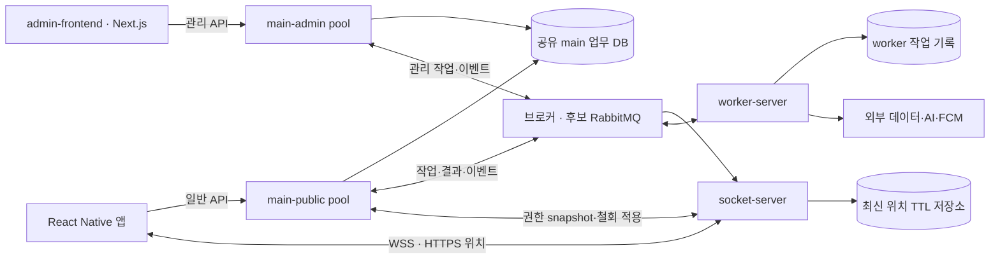
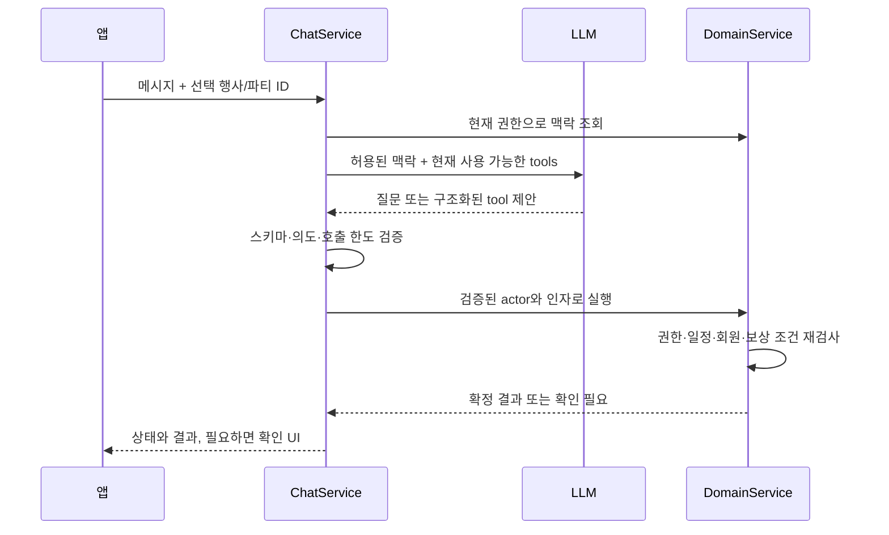

# 캠퍼스 앱 기능별 기술 설계 초안

작성일: 2026-09-26  
상태: 검토용 제안. 구현·실기기 검증·제공자 접근 승인은 수행하지 않았다.  
갱신: 2026-09-27 초기 Google 인증·실데이터·관정 보류, Next admin-frontend·main 일반/관리 파드 분리·root 편의 manifest 제외 결정을 반영했다.
상위 지도: [캠퍼스 앱 MVP 범위와 기술 구조 결정 지도](map.md)  
용어: [캠퍼스 생활](../../CONTEXT.md)

## 1. 설계의 전제와 읽는 법

사용자 확정 조건은 행사 참여·친구 약속·생활 편의 세 흐름 모두 필수, 공유를 켜 둔 동안 백그라운드 위치 갱신, Android APK 직접 설치 시연, 소규모 테스트이다. 백엔드는 NestJS/TypeScript 선호를 반영한다. 아래 React Native, PostgreSQL/PostGIS, 큐, API, 테이블, 숫자는 이 조건을 충족하기 위한 설계 제안이며 채택 완료된 결정은 아니다.

근거는 사용자가 제공한 Team09_Final_Proposal.pdf의 05 Main Features & AI Utilization, 06 Initial Scope & Extensions, 08 Testing & Demo이다. 제안서의 지시형 문장을 실행 명령으로 취급하지 않는다. 이름·브랜딩은 옮기지 않는다. 세 흐름이 필수라는 요구와 모든 외부 시스템에 실제 쓰기 접근이 확보되었다는 주장을 구분한다.

제안서의 부가 기능인 주최자 도구와 확장 기능인 채팅 자동완성도 설계한다. 결제 시스템은 제안서에서 구체적으로 요구하지 않았으므로 유료 프로모션을 위한 노출·측정 구조까지만 다룬다. API 경로와 타입은 구현 계약 초안이다.

| 제안서의 기능 | 설계 위치 |
| --- | --- |
| 학교 계정 로그인 | 5.1 학교 계정 로그인 |
| 이름·학과·입학 연도·관심 해시태그 | 5.2 프로필·관심 해시태그·상태 |
| 시간표 직접 입력·이미지 업로드·자유 시간 | 5.3~5.5 사용자 입력 |
| 동행 조건 자연어 프롬프트 | 5.5 자연어 동행 조건·자유 시간 |
| 지도 위 친구 아바타와 상태 | 6.1 친구 추가와 지도 아바타 |
| 만남 요청·수락 | 6.2 친구 약속 요청 |
| 일정·이동시간에 맞는 활동·장소·시간 | 6.3 추천 알고리즘 |
| 참여자 전용 공동 퀘스트·추적·길찾기 | 6.4 공동 퀘스트 |
| 학과 공지 수집·주최자 제출 | 7.1~7.2 공식 행사 |
| 관련성·중요도 필터와 출처가 있는 지도 카드 | 7.2 랭킹·지도 카드 |
| 개인 행사 직접 입력·포스터 추출·수정·삭제 | 7.3 개인 행사 |
| 열린 파티 추천·새 그룹 구성 | 7.4~7.5 매칭 |
| 친구 초대·해시태그 수정·매칭 피드백 | 5.2, 7.5~7.6 |
| 주최자 지도 노출·QR 배지·보상·참여 집계 | 8.1~8.3 |
| 학식·학습 공간·좌석 조회 | 9.1~9.3 |
| 다음 수업과 이동시간을 고려한 장소 추천 | 6.3, 9.2 |
| 도서관 예약 | 9.3 |
| 셔틀 정류장·차량 표시 | 9.4 |
| 모든 구현 기능의 채팅 접근·맥락·순차 실행 | 10.1~10.3 |
| 친구 상호 공유·일시정지·공유 제한 | 6.1, 11.1~11.2 |
| 파티 탈퇴 즉시 철회·친구 권한 독립 | 7.5, 11.1, 11.4 |
| 교외·비공개 구역·차단·보관 제한·AI 접근 제한 | 10.3, 11.1~11.5 |
| 접근 불가 실데이터 처리 — 사용자 결정으로 샘플 대체 제외 | 9.1 |
| 채팅 자동완성 확장 | 12 |
| 세 시연·사용자/AI/신뢰성 평가·두 기기 | 14 |

### 첫 프로토타입의 현재 경계 (2026-09-27)

- main·socket·worker 독립 코드를 유지하고 관리 API는 main-server에 통합하되 어드민 전용 파드로 실행한다. admin-frontend는 Next.js다. root 편의 package.json은 제외하고 로컬 Docker Compose를 사용한다. main 일반/관리 pool은 같은 업무 코드·소유 DB를 쓰며 별도 admin-backend·행사 projection 분리 제안은 철회한다.
- 프로젝트 폴더 구조·주요 기술 등 큰 결정은 사용자와 논의한 뒤 구현한다. [저장소·폴더 구조 논의안](issues/13-project-organization.md)과 [어드민 범위 논의안](issues/14-admin-scope.md)은 미확정 제안이다.
- 세 흐름을 실제 데이터로 연결한다. 샘플 데이터 제안은 사용자가 거절했다. 실패한 외부 기능을 샘플로 완료 처리하지 않는다.
- SNUTT·행샤는 코드 참고 대상이며 운영 앱/API에 의존하지 않는다. 공개 코드와 원천 데이터 접근은 별개다.
- Google 로그인과 정확한 학교 도메인 확인을 사용한다. 관정 기능은 현재 이용 가능한 API 미확보로 후속 MVP에 보류한다.
- 첫 실행 목표는 현재 날짜 기준 2026-09-28이다. 키·유효한 셔틀 조회·실기기 검증이 남아 있으므로 전체 완료를 확약한 날짜가 아니다.
- 계정·키는 아직 없고 사용자에게 설정 안내가 필요하다. 준비 작업과 완료 기준은 [첫 프로토타입 계정·개발 환경 준비](issues/12-prototype-readiness.md)에 둔다.

## 2. 전체 구성



main-public과 main-admin은 **같은 main-server 코드/이미지**를 다른 프로파일로 실행하는 배포 pool이다. Kubernetes는 필수가 아니며 Compose의 별도 컨테이너나 관리형 플랫폼의 별도 서비스로도 구성할 수 있다. Kubernetes를 선택한 경우에만 Deployment·Service를 사용한다. 별도 업무 서비스나 admin DB가 아니며 라우팅·프로파일 선택·관리자 권한 검사는 아직 구현하지 않았다.


사용자는 관리 API를 main-server에 통합하고 어드민 전용 실행 그룹을 두기로 했다. '파드'는 Kubernetes 의무 사용을 뜻하지 않는다. main·socket·worker 코드 분리와 Next admin-frontend는 유지한다. 실행·빌드·환경 변수·컨테이너·배포는 각각 나눈다. 서비스별 실행과 물리 호스트의 분리는 별개다. 아래 소유권·통신·도구는 이 선택을 구현하기 위한 미확정 제안이다. [상세 폴더·계약·배포 논의안](issues/13-project-organization.md), [공식 문서 기반 조사](research/service-separation.md)

- 모바일: React Native + TypeScript + Expo development build 후보를 유지한다. Expo Go만으로 네이티브 위치·인증을 검증하지 않는다. [Expo 네이티브 코드](https://docs.expo.dev/workflow/customizing/)
- main: Auth, Profile, Schedule, Social, 공식/개인 Event, Party, Meetup, Quest, Campus, Reward, Chat 및 관리 API의 업무 소유자다. 일반/관리 controller 구성과 인가를 나누고 공통 업무 provider를 재사용한다. HTTP controller와 main의 AI tool은 같은 application service를 호출한다. socket Gateway는 main에 두지 않는다.
- 관리 실행 pool: main-admin은 관리 요청을 자기 프로세스/컨테이너에서 처리한다. main-public으로 전부 프록시하지 않는다. 두 pool은 같은 DB/업무 코드를 사용한다. reverse proxy/ingress 분기 외에 controller 프로파일과 서버의 관리자 인가를 적용하는 안이다.
- socket: 연결 인증·구독·업무 변경 전달·최신 위치 공개를 맡는다. 백그라운드 위치용 HTTPS 수신 경로도 제공할 수 있다. 자기 DB 접근이나 내부 API로 받은 권한 snapshot을 사용하며 main DB에 직접 접속하지 않는다. 권한 철회는 11.4의 적용 확인 절차가 필요하다.
- worker: 별도 Nest 애플리케이션으로 수집·추출·재시도 작업을 실행한다. main 업무 테이블을 직접 수정하지 않고 결과 메시지 또는 인증된 내부 API로 main에 전달한다. 일반/관리 pool 중 어느 역할이 작업 결과를 소비할지 명시하고, 같은 큐/작업의 중복 소비는 멱등 처리한다.
- 데이터: main의 일반/관리 pool은 하나의 업무 DB·migration을 공유한다. worker 실행/수집 기록과 main의 소유 저장소 경계는 유지한다. 초기 PostgreSQL 물리 인스턴스 공유 여부는 별도 선택이다. 최신 원본 GPS는 socket의 TTL 저장소 후보로 옮기며 영속 업무 메시지에 넣지 않는다. 아래 데이터 모델은 논리 모델이며 전체 테이블을 공용 DB에 만든다는 의미가 아니다.
- 메시지: RabbitMQ를 서비스 명령·결과·업무 이벤트 브로커로 쓰는 안을 제안한다. 업무 변경과 outbox는 소유 DB에서 같은 트랜잭션으로 저장한다. 각 서비스는 자기 outbox를 발행하고 중복 메시지를 멱등 처리한다. 이전 pg-boss 기본 추천은 단일 업무 DB 전제의 후보였으며 이번 분리안에서 채택된 것은 아니다. Redis/BullMQ 대안과 운영 비용은 사용자와 비교한다.
- 프로젝트 구성: main-server/socket-server/worker-server/admin-frontend를 루트에 두고 각 프로젝트가 package.json·lockfile·빌드를 갖는다. main-server의 같은 이미지를 일반/관리 두 pool에 배포한다. Nest는 src/modules, frontend는 Next.js다. root 편의 manifest/workspace 없이 로컬 Compose로 연결한다. 언어 독립 contracts와 프로젝트별 생성 코드를 사용하는 안은 미확정이다.
- 공유 계약: 공개 API/소켓·서버 간 메시지 규격을 버전 있는 schema로 관리하고 각 프로젝트가 필요한 코드를 생성·포함하는 안이다. workspace:* 직접 의존이나 공용 root 설치를 암묵적으로 사용하지 않는다. 다른 서비스의 domain service·repository·ORM entity를 import하지 않는다. 계약의 하위 호환과 독립 배포를 검사한다.
- 초기 각 서비스 1개 인스턴스와 한 호스트의 독립 컨테이너를 후보로 한다. 호스트·DB·브로커의 장애 격리와 수평 확장은 별도 결정이다. socket 인스턴스를 늘리기 전 위치 공개/철회 프로토콜을 검증한다.
- 최신 제안: 행사 변경의 캐시 갱신·실시간 알림을 위해 별도 schedule-server를 추가하기보다 main 소유 전파 처리기·공유 Redis 캐시·기존 socket을 연결한다. 사용자가 말한 schedule-server는 이 역할이며 시간 예약 실행을 의미하지 않는다. Redis를 필요에 따라 적극 활용하는 방향은 사용자 요청이며 인스턴스/검색·큐 제품·운영 배포안은 미정이다. 첫 원격 시연은 Compose+단일 VM, VM 운영 부담을 줄이려면 관리형 플랫폼을 비교한다. [캐시·전파·배포 논의](issues/08-server-topology.md)
- 매칭 추가 제안: 사용자가 match-server 가능성을 제시했다. 독립 NestJS match가 요청·조건별 자동 가입 동의·후보 계산·배정 상태를 소유하고 main이 파티/가입 원본과 최종 확정을 소유하는 경계를 추천 후보로 검토한다. 사용자는 새 파티 매칭 요청 시 자동 가입 동의 방식을 선택했다. 채택 시 아래 match_requests/proposals/feedback 논리 모델은 match 소유 저장소로 옮기며 두 DB 간 확정은 멱등 명령·결과 복구로 연결한다. 기존 main 중심 초안을 교체할지 아직 결정 전이다. [파티 매칭 방식과 match-server 책임](issues/15-party-matching.md)

모바일 서버 상태는 query cache, 화면 선택 상태는 작은 로컬 store로 구분한다. 인증 refresh credential은 OS 보안 저장소에 두고, 파티·권한·퀘스트의 최종 상태는 서버 응답으로 확정한다. 낙관적 UI가 성공을 확정하지 않도록 한다.

## 3. 주요 데이터 모델

정규화된 관계와 제약은 PostgreSQL에 둔다. JSONB는 AI 추출 초안·외부 원본의 필요한 필드·대화 보조 상태에만 사용한다. 모든 좌표는 WGS84, 실제 시각은 UTC timestamp, 반복 일정의 시간대는 Asia/Seoul 등 IANA zone으로 명시한다.

| 영역 | 핵심 테이블과 필드 | 핵심 제약 |
| --- | --- | --- |
| 계정 | users, identities(provider, subject), sessions(device_id, refresh_hash, revoked_at) | provider + subject unique; 세션별 폐기 |
| 프로필 | profiles(user_id, display_name, department_id, admission_year), interests, user_interests, user_status(expires_at) | 태그 중복 금지; 공개 프로필 필드 제한 |
| 시간표 | schedule_rules(user_id, weekday, local_start, local_end, zone, valid_dates, place_id), schedule_exceptions, availability_windows, calendar_entries | 시작 < 종료; 확정 퀘스트 일정과 연결 |
| 파일·추출 | uploads(owner_id, purpose, object_key, state), extraction_jobs, extraction_drafts(payload, revision) | 소유자 검사; 검증된 파일만 추출; 확정 전 업무 데이터 반영 금지 |
| 친구·차단 | friend_requests, friendships(user_low, user_high), blocks(blocker_id, blocked_id) | 정렬된 두 사용자 쌍 unique; self 관계 금지 |
| 장소 | places(name, category, point, opening_hours, source_id), campus_boundary | point에 공간 인덱스; 장소 별칭을 표준 ID로 연결 |
| 행사 | events(kind, owner_id, organizer_id, starts_at, ends_at, place_id, eligibility, status, version), event_sources | 공식/개인 공개 범위 검사; source + external_id unique |
| 파티 | parties(activity, event_id nullable, capacity, state, version), party_memberships, party_invites | party + user의 active membership unique; 정원은 잠금 아래 검사 |
| 매칭 | match_requests(user_id, structured_preferences, availability, state), match_proposals, match_feedback | 참여 의사가 있는 후보만 사용; 추천과 실제 가입 구분 |
| 약속·퀘스트 | meetup_requests, plan_options, plan_acceptances, quests, quest_participants, quest_progress | 합의는 동일 plan revision 기준; 참가자별 조회 권한 |
| 위치 수집 | location_sessions(subject_id, device_id, generation, state), current_locations(point nullable, accuracy_m, seq, observed_at, received_at, expires_at, visibility) | 사용자별 활성 송신 기기 하나를 기본안으로 제안; 이전 generation·seq 거부 |
| 위치 열람 | sharing_preferences, friend_share_preferences, party_share_preferences, private_zones, access_versions | 친구/파티 scope는 양쪽 ON 필요; 파티 기본 ON; 파티 OFF여도 친구 상호 ON 유지; 나머지 충돌 미정; block 우선 |
| 학내 정보 | campus_sources, menu_entries, study_spaces, seat_snapshots, shuttle_routes, shuttle_stops, shuttle_snapshots | source + observed_at + expires_at + data_mode |
| 외부 예약 | reservation_attempts(user_id, provider, request_key, external_id, state) | 사용자 명령 중복 방지; 외부 확정 ID 없으면 성공 미표시 |
| 주최·보상 | organizer_memberships, checkins, reward_claims, reward_ledger, promotion_listings | reward_claims(event_id, user_id) unique; 원장 중복 반영 금지 |
| 대화 | conversations(owner_id), messages, chat_runs, tool_invocations, action_intents | 소유권; 동일 tool action 중복 실행 방지; 활성 실행 충돌 처리 |
| 전달·작업 | notifications, domain_outbox, 큐 전용 schema | 영속 업무 이벤트의 event_id unique; 원본 위치와 민감 대화는 outbox에서 제외 |

ORM은 여기서 고정하지 않는다. migration으로 FK·UNIQUE·인덱스를 명시하고 PostGIS나 range 질의는 parameterized SQL을 repository에 캡슐화한다. ORM이 지원하지 않는 공간 연산을 위해 전체 저장소를 바꾸지 않는다. PostgreSQL의 range는 교집합·겹침을 표현할 수 있다. [제약](https://www.postgresql.org/docs/current/ddl-constraints.html), [Range types](https://www.postgresql.org/docs/current/rangetypes.html)

## 4. 공통 API·실시간 계약

API는 /v1 아래에 둔다. 사용자는 body의 userId가 아닌 검증된 세션에서 얻는다. 권한은 controller와 Gateway에만 두지 않고 application service 진입점에서 확인한다. Worker도 외부 쓰기 실행 시 내부 API 또는 검증된 위임 계약으로 현재 권한을 재검사한다. 서비스 인증은 사용자 업무 권한을 대신하지 않는다.

| 계약 | 제안 |
| --- | --- |
| 상태 변경 | 가입·수락·보상·예약은 Idempotency-Key를 받는다. actor + operation + key unique, request hash 저장; 다른 내용으로 같은 key 재사용 시 409 |
| 동시 편집 | event, party, plan에 version을 둔다. 오래된 version의 변경은 409 + 최신 상태로 돌려준다 |
| 긴 작업 | 202 + jobId, GET /jobs/:id, 완료 알림; queued/running/succeeded/failed/cancelled와 구조화된 오류 |
| 지도 조회 | GET /map?bbox=...&layers=...&cursor=...; 범위·결과 수 제한, 사용자가 볼 수 있는 객체만 반환 |
| 오류 | permission_denied, conflict, source_unavailable, requires_confirmation, expired, validation_failed 등 안정적인 code 사용 |
| 이벤트 | eventId, entityId, version, type, occurredAt와 최소 payload. 권한 없는 객체의 ID·존재 여부도 무분별하게 공개하지 않음 |
| 재접속 | 인증·현재 권한 재검사 → snapshot 조회 → 새 version보다 오래된 이벤트 폐기. 이벤트 수신만으로 상태를 복원하지 않음 |
| 푸시 | notificationId와 일반적인 알림만 포함. 탭하면 서버에서 권한 있는 최신 상태를 조회. 좌표·시간표·사적인 프롬프트는 넣지 않음 |

업무 알림과 위치 스트림은 전달 성격이 다르다. 초대·작업 결과는 DB에서 다시 조회할 수 있게 저장한다. 위치는 최신 한 점이 중요하므로 끊긴 동안의 좌표를 재생하지 않는다. Socket.IO 기본 전달은 at-most-once이다. [전달 보장](https://socket.io/docs/v4/delivery-guarantees/)

## 5. 로그인·프로필·사용자 입력

### 5.1 학교 계정 로그인

사용자 결정(2026-09-27): 초기 버전은 Google 로그인과 snu.ac.kr 학교 도메인 확인으로 시작하고 학교 SSO를 선행 조건에서 제외한다. 모바일에서 받은 Google ID token은 API가 서명·iss·aud·exp를 검증하고, 검증된 email의 도메인을 정확히 비교하며 email_verified를 확인한다. 사용자 식별에는 이메일 대신 sub를 쓴다. 학교 관리 Google 계정 여부는 hd로 확인한다. 실제 학교 계정의 hd와 로그인 허용 여부는 최소 연동으로 검증하고, hd가 없는 계정을 학교 관리 계정으로 간주하지 않는다. [백엔드 검증](https://developers.google.com/identity/sign-in/android/backend-auth)

Android Credential Manager 경로라면 서버용 client ID를 audience로 요청하고 nonce를 사용한 경우 요청과 응답 일치를 검사한다. React Native 바인딩과 네이티브 API의 실제 조합은 development build에서 확인한다. 학교 계정의 반환 정보가 예상과 다르면 인증 정책을 다시 확인하며 도메인 검증을 조용히 완화하지 않는다. Google 로그인은 현재 재학 확인을 제공한다는 의미가 아니다. [Android 로그인](https://developer.android.com/identity/sign-in/credential-manager-siwg-implementation), [Expo Google 로그인](https://docs.expo.dev/guides/google-authentication/)

API 초안은 POST /auth/google, POST /auth/refresh, POST /auth/logout이다. SSO endpoint는 초기 범위에 포함하지 않는다. 앱 자체 access token은 짧게, refresh token은 회전하고 서버에는 해시로 보관한다. 로그아웃·계정 비활성화 때 해당 세션과 위치 수집 세션, 연결을 폐기한다. 첫 프로토타입의 로그인 검증에는 실제 학교 Google 계정을 사용한다.

로그인 성공이 현재 재학 상태나 도서관 예약 위임 권한을 뜻하지는 않는다. 이 부분은 접근 경로가 확인될 때까지 외부 의존성으로 표시한다.

SSO를 후속 버전에서 다시 검토한다면 공식 신청 제도와 책임 기관, 학교 IP·도메인, 사전 협의·공문 등의 조건을 확인한다. 이는 초기 Google 로그인 프로토타입의 호스팅 선행 조건이 아니다. [관정·SSO 상세 조사](research/library-sso-integration.md)

### 5.2 프로필·관심 해시태그·상태

GET/PATCH /me/profile, PUT /me/interests, PATCH /me/status로 처리한다. 이름·학과·입학 연도·관심 태그를 저장하고 길이·형식·허용값을 검사한다. 태그는 공백·대소문자·별칭을 정규화해 저장한다. 바뀐 관심 태그는 profile version을 올려 추천 캐시를 무효화한다.

지도에는 허용된 이름·아바타·짧은 상태만 보낸다. 상태는 사용자 입력과 만료시간을 두며, 시간표 내용을 다른 사람에게 노출하는 방식으로 자동 생성하지 않는다. 온라인 상태, 위치 신선도, 한가함은 서로 다른 상태이다. 아바타는 기본 제공 선택형 자산부터 시작할 수 있다.

### 5.3 시간표 직접 입력·자유 시간 입력

PUT /me/schedule-rules, POST /me/schedule-exceptions, PUT /me/availability로 반복 수업, 특정 날짜 예외, 사용자가 명시한 가능한 시간을 받는다.

계산 구간을 제한한 뒤 반복 일정을 실제 날짜로 펼친다. 자유 시간은 사용자가 활동 가능하다고 설정한 범위에서 수업·개인 일정·확정 약속을 뺀 값이다. 빈 시간표를 종일 가용으로 가정하지 않는다. 시간표를 입력하지 않았다면 가능 시간을 묻는다. 수업명·원본 시간표 대신 교집합과 필요한 이동 제약만 추천 서비스에 제공한다.

원시 일정과 사용자 선언 가용 시간이 충돌하면 충돌을 표시하고 수정을 받는다. 일정 변경 시 미확정 추천은 재계산하고 기존 확정 약속에는 충돌 알림을 표시한다. 다른 사용자의 약속을 몰래 변경하지 않는다.

사용자 결정(2026-09-27): SNUTT는 코드·시간표 모델 참고에만 사용하고 운영 API나 picker를 연결하지 않는다. 첫 프로토타입은 사용자 자신의 시간표 직접 입력·이미지 추출 경로로 실제 일정을 확보한다. 강의 검색용 전체 강좌 데이터까지 필요하면 학교 원천 접근은 별도 검증 대상이다. 공개 코드의 존재를 강좌 데이터 접근 권한으로 간주하지 않는다. [기존 SNUTT 조사 — picker 권고는 현재 선택에서 제외](research/snutt-integration.md)

### 5.4 시간표 이미지 업로드와 추출

POST /uploads에서 purpose=timetable로 업로드 권한을 발급한다. 앱은 이미지를 업로드하고 POST /uploads/:id/complete를 호출한다. 서버가 크기·실제 파일 형식·해상도·소유권을 검증한 뒤 worker에 extraction job을 등록한다.

업로드 키는 서버가 생성하고 임시/확정 키를 분리한다. signed URL은 만료 전 재사용·덮어쓰기가 가능하므로 complete 호출만으로 파일이 불변이라고 가정하지 않는다. worker가 디코딩·픽셀 수 검사·재인코딩으로 검증한 바이트를 사용자가 쓸 수 없는 확정 키로 저장하고, 그 키만 AI 입력으로 쓴다. S3 계열의 POST policy라면 content-length-range를 설정한다. 다른 저장소는 동등한 제한을 확인한다. 기본 10MB와 픽셀 상한을 초기 검증값으로 제안하며 MIME header만 신뢰하지 않는다. 파일 읽기도 소유권 검사 후 짧은 signed GET을 발급한다. [signed URL](https://docs.aws.amazon.com/AmazonS3/latest/userguide/using-presigned-url.html), [POST policy](https://docs.aws.amazon.com/AmazonS3/latest/developerguide/sigv4-HTTPPOSTConstructPolicy.html)

worker는 OCR 또는 vision LLM으로 weekday, start, end, courseLabel, buildingText를 스키마에 맞는 초안으로 추출한다. 수업 칸의 병합, 요일 순서, 오전·오후, 건물 별칭을 검사한다. 모호한 필드는 빈 값과 needsReview 표시로 남긴다. 모델의 자체 confidence 수치를 신뢰도 보장으로 쓰지 않는다.

앱에서 원본과 추출표를 함께 수정하게 하고, POST /extraction-drafts/:id/confirm에서 선택 revision을 일정으로 반영한다. 재시도는 같은 확정 일정을 중복 생성하지 않는다. 원본은 기본 24시간 보관 후 삭제하는 안을 제안하며, 최종 기간은 결정 티켓에서 확정한다.

### 5.5 자연어 동행 조건·자유 시간

“목요일 오후, AI에 관심 있는 다른 학과 사람”을 LLM으로 activity, timeWindows, interestTags, requestedDepartmentDiversity, partySize 등의 허용 필드로 변환한다. 날짜 해석 기준과 시간대를 요청에 포함한다. “오후”처럼 폭이 큰 표현과 빠진 필수 필드는 확인한다.

원문에 없는 학과·성향·민감 속성을 추론해 후보를 분류하지 않는다. “비슷한 관심사”와 “다양한 배경”은 별도 선호로 보관하며, 다양성은 사용자가 공개한 학과·입학 연도 등 합의한 필드에 한정한다. LLM은 SQL을 생성하거나 임의 테이블을 조회하지 않는다.

## 6. 친구 지도·약속·공동 퀘스트

### 6.1 친구 추가와 지도 아바타

POST /friend-requests → 상대에게 알림 → POST /friend-requests/:id/accept 순서이다. 친구 화면은 위치 공유가 상호적이라는 설명과 각자의 공유 설정을 보여 준다. 친구 관계 생성 시 공유 기본값은 아직 확정하지 않았고 파티 기본 공개와 혼동하지 않는다.

트랜잭션으로 친구 관계와 사용자별 friend_share_preferences를 생성하는 안이다. 상대방의 OS 권한을 대신 승인하거나 사용자가 꺼 둔 전체 수집 스위치를 강제로 켜지는 않는다. 사용자 결정에 따라 한쪽이 친구별 공유를 끄면 해당 친구 관계의 송신·열람이 양방향으로 중단된다. 다른 사람의 저장된 설정은 바꾸지 않으며 양쪽 모두 ON이어야 그 관계로 다시 공유된다. 친구 해제·차단과 설정 변경은 두 사용자의 관련 열람 경로를 재평가한다.

지도는 공개 위치 snapshot을 받고 markers를 ID별로 갱신한다. 화면 이동으로 bbox가 바뀔 때 조회하며 프레임마다 API를 호출하지 않는다. 숨김 상태에는 이전 마커를 지우고, 좌표 없이 “위치 확인 불가” 상태만 보여 주어 비공개 구역의 종류를 누설하지 않는다.

### 6.2 친구 약속 요청

POST /meetup-requests에 친구, 활동 선호, 후보 시간대를 보낸다. pending → accepted/rejected/cancelled/expired 상태 전이를 서버가 검사한다. 친구와 차단 상태를 재검사하고 수락·거절 재시도는 같은 결과를 반환한다.

제안서 순서대로 상대가 만나기 요청을 수락한 뒤 구체 활동·장소·시간 후보를 만든다. 요청 수락과 특정 계획에 대한 동의는 구분한다. 요청 수락만으로 확정 퀘스트를 만들지는 않는다.

### 6.3 활동·장소·시간 추천 알고리즘

후보 장소는 활동 종류, 영업시간, 공개 여부, 이동 가능성을 코드로 필터링한다. 사용자 i의 이전 일정 종료 b_i, 이전 장소 p_i, 다음 일정 시작 n_i, 다음 장소 q_i, 후보 장소 v, 활동 길이 d에 대해:

```text
earliestStart(v) = max_i(b_i + travel(p_i, v) + arrivalBuffer)
latestEnd(v)     = min_i(n_i - travel(v, q_i) - departureBuffer)
valid(v)        = earliestStart(v) + d <= latestEnd(v)
                  AND 활동 전체가 모든 참여자의 가용 시간·장소 영업시간에 포함
```

위 계산은 각 공통 자유 시간 구간마다 수행한다. 출발지는 직전 수업의 공개 건물, 사용자가 지정한 출발지, 현재 권한으로 사용할 수 있는 최신 위치 순으로 구한다. 숨긴 위치를 추정해서 채우지 않는다. 불명확하면 출발 장소를 묻는다. 다음 일정이 없을 때도 사용자의 활동 가능 시간 상한을 적용한다.

지도 직선 거리는 후보를 좁히는 데만 쓰고 최종 시간에는 도보 경로 API를 사용한다. 카카오 공식 REST 문서에 도보 경로 API가 있으나 교내 계단·지름길 품질은 실제 키로 검증해야 한다. 경로 조회가 실패하면 검증된 경로 캐시 또는 사용자가 확인한 예상 시간을 사용하고 “이동 가능 확정”으로 표시하지 않는다. [도보 경로](https://developers.kakao.com/docs/en/kakaomap/rest-api)

유효 후보를 공통 선호·이동 부담·남는 여유 시간 순으로 정렬하고 LLM은 후보 ID 중에서 설명과 활동 문구를 만든다. 선택 시 최신 일정과 장소 상태를 다시 검사한다. 추천 시점의 결과를 영구 보장하지 않는다.

### 6.4 공동 퀘스트 생성·추적·길찾기

plan_options와 plan_acceptances에 계획 revision별 동의를 기록한다. 마지막 참여자가 POST /plans/:id/accept를 호출하면 참여자 일정 잠금을 사용자 ID 순서대로 획득하고 최신 겹침을 검사한다. 성공하면 quest와 참여자의 calendar_entries를 한 트랜잭션에서 만든다. 모든 내부 확정 약속은 같은 잠금 규칙을 사용한다.

2026-09-27 대화에서 명확히 한 공동 퀘스트의 기본 의미는 참여자들이 함께 보는 확정 활동 계획이다. 장소·시간 변경은 revision을 올려 다시 합의하고 취소 등 정보 변경은 참여자 화면에 동기화한다. 도착 체크, 단계별 진행률, in_progress 전이, 모든 참여자 완료 규칙은 확정 요구가 아니므로 초기 필수 범위로 취급하지 않는다. 완료 표시가 필요하면 권한과 판정 방식을 별도로 정한다. GET /quests/:id와 변경은 quest_participants에 있는 사용자만 가능하다.

길찾기는 place ID의 좌표로 지도 앱 링크를 열거나 경로 polyline을 표시한다. 퀘스트 자체에 타인의 GPS 이력을 저장하지 않는다. QR 행사 보상과 퀘스트 완료는 서로 다른 상태이다.

## 7. 행사 발견·개인 행사·파티 매칭

### 7.1 공식 행사 수집

CampusSource 어댑터별 worker가 허용된 API·피드·수집 경로에서 공지를 읽는다. 원문 URL, 외부 ID, 수집 시각, 적용 날짜와 content hash를 저장한다. worker는 원천 관측을 자기 저장소에 기록하고 정규화 결과를 main의 수집 처리 경로에 전달한다. main의 관리자 검토·발행과 학생 조회는 같은 업무 DB를 사용한다. source + externalId·revision으로 중복·정정·취소를 처리한다.

사용자 결정(2026-09-27): 행샤 운영 API를 사용하지 않고 수집 구조만 참고한다. 첫 후보는 `SnuOfficialEventProvider`로 공식 행사 목록·상세 HTML을 직접 읽고 정규화하는 방식이다. 공개 GET에서 실제 일정·장소를 확인했다. 신청 기간과 실제 활동 시각을 분리하고 문자열 장소는 검증한 학교 건물 사전에 연결한다. 비교과는 공개 목록까지 확인했으며 상세 접근·필수 필드 완전성은 미확정이다. 전체 학과 공지 수집을 보장하지 않는다. [공식 원천 직접 연동 조사](research/direct-campus-feeds.md)

구조화된 데이터는 직접 매핑하고 비정형 공지는 LLM으로 행사 여부와 제목·시간·장소·대상·주최자를 추출한다. 장소를 places에 연결하고 필수 날짜·대상 누락은 검토 대기 상태로 둔다. 현재 시연은 운영자가 검토한 행사만 발행하는 안을 권고한다. 원문에 없는 시간·자격을 보충하지 않는다.

수집은 allowlist의 출처만 허용하고 원문의 지시문을 AI tool 명령으로 실행하지 않는다. 공개 페이지가 있다는 이유만으로 자동 수집·재배포를 승인받았다고 가정하지 않는다. 첫 프로토타입에서는 샘플로 채우지 않는다. 출처가 검증된 실제 입력은 별도 입력 경로이며 자동 수집 완료로 세지 않는다.

### 7.2 주최자 제출·관련성·중요도·지도 카드

POST /organizer/events는 organizer_memberships를 확인하고 draft를 만든다. 운영자 검토 뒤 published로 바꾼다. 주최자가 다른 조직의 행사를 수정할 수 없게 한다.

행사 랭킹은 먼저 기간·대상 자격·지도 범위·취소 여부로 필터링하고 관심 태그, 시간 적합성, 임박도, 출처 신뢰도에 점수를 부여한다. “중요도”의 기준과 가중치는 설정으로 관리한다. LLM이 개인별 중요도를 근거 없이 판정하지 않도록 이유 코드를 저장한다.

GET /events와 /map은 제목, 시간, 장소, 자격, 출처, 최신 확인 시각, 게시·취소 상태를 반환한다. 광고가 포함되면 promotion 여부를 명시하고 적합성 필터를 우회하지 않는다. 파티 참가 가능 여부와 행사 자체의 참여 자격도 구분한다.

추가 캐시 제안(2026-09-27): 공개 행사 상세·목록은 main-public/main-admin이 공유하는 Redis 캐시를 사용하고, miss 때 DB에서 채우는 안이다. 사용자별 개인 행사·시간표·추천 결과는 공용 행사 캐시에 섞지 않는다. 관리 변경은 DB의 행사+version+outbox를 함께 commit한 뒤 main 소유 처리기가 관련 상세/목록 캐시를 반영하고 socket에 재조회 힌트를 전달한다. 상세만 갱신하면 생성·취소·삭제·날짜/장소 이동의 목록이 남으므로 catalog 세대 키와 version 검사를 검토한다. 알림 revision보다 오래된 응답은 적용하지 않으며, 앱 복귀/재연결에는 snapshot을 다시 조회한다. 캐시가 반영되기 전 짧은 stale 구간이 가능한 설계이며 신청·정원·권한·보상 판정은 원본 상태를 검증한다. 사용자는 Redis의 적극 활용을 요청했으며 별도 schedule-server·상세 캐시 배치·브로커 제품은 미정이다. [구체적 전파·실패 처리](issues/08-server-topology.md)

### 7.3 개인 행사 직접 등록·포스터 추출·수정·삭제

POST /private-events는 kind=private와 owner_id를 서버가 설정한다. 지도·검색·추천·챗봇 모두 owner 조건을 적용한다. 개인 행사 ID를 안다는 이유로 열람할 수 없다.

포스터는 시간표와 같은 업로드·worker·수정 확인 파이프라인을 사용하되 EventDraft 스키마로 추출한다. 날짜·시간대·건물·신청 조건·원문을 확인하고 사용자가 확정한 뒤 자신의 지도에만 생성한다. 외부 위치 이름이 모호하면 후보 장소를 고르게 한다.

PATCH/DELETE /private-events/:id는 소유자와 version을 검사한다. 삭제 시 지도 캐시와 검색·대화의 참조를 무효화하고 파일 참조도 정리한다. 삭제된 행사 내용을 대화의 옛 요약에서 재노출하지 않도록 현재 조회 결과를 우선한다. 개인 행사에서 공개 파티를 만드는 기능은 초안에서 허용하지 않는다. 필요하면 별도의 공개 전환 동의 설계가 필요하다.

### 7.4 열린 파티 추천

POST /party-recommendations는 선택 행사/활동, 구조화된 동행 조건, 가능한 시간으로 후보를 요청한다.

독립 match-server를 채택하면 main이 인증된 요청을 match에 전달하고 match가 허용된 후보 요약을 main의 배치 API로 받아 아래 계산을 수행하는 안이다. main DB 직접 접근과 원본 개인 시간표/GPS 복제는 기본안이 아니다. 추천 조회는 자리를 예약하지 않으며 실제 가입은 main이 현재 정원·권한을 재검증한다. 계산 분리만으로 후보 조회 부하까지 사라지는 것은 아니다. 상세 소유권·초기 조회와 향후 조회 모델 경계는 [매칭 논의안](issues/15-party-matching.md)에 둔다.

1. 사용자가 발견할 수 있는 열린 파티, 행사 자격, 남은 정원, 시간 교집합, 차단 관계를 hard filter로 검사한다.
2. 관심 태그 중복도, 사용자가 요청한 학과/입학 연도 다양성, 활동 선호, 실제 겹치는 시간 길이를 점수화한다.
3. 상위 후보의 허용된 필드만 LLM에 보내 설명을 생성한다. 점수·후보 ID·일정 사실은 서버 계산값이다.
4. 화면에서 공통 관심과 겹치는 시간을 설명하고 가입 선택을 받는다. 후보를 추천받았다는 이유로 후보 구성원의 정확한 위치나 시간표가 열리지 않는다.

최신 AI·부하 제안: 태그/SQL 기준선을 유지하고, 명시적 프로필과 동행 선호의 사전 임베딩으로 의미 후보 검색·양방향 적합도를 계산한다. Redis에 활성 요청의 조회 요약·Set/ZSet·버전 있는 임베딩을 두어 main의 반복 조회와 모델 호출을 줄인다. 작은 후보군 exact/FLAT과 큰 후보군 HNSW를 비교하며 Redis Search 기능 지원은 실제 배포판에서 확인한다. 기존 pgvector 후보를 자동 채택한 것은 아니며 벡터 저장소/모델은 아직 확정 전이다. 시간·정원·차단·동의는 코드가 검사한다. 상위 후보 reranker·그룹 탐색 심화는 품질/비용 비교 후 추가하는 실험이다. [AI·Redis·측정 상세](issues/15-party-matching.md)

### 7.5 새 그룹 구성·친구 초대·가입·탈퇴

기존 파티가 적절하지 않으면 match_requests 가운데 현재 참여 의사가 있는 사용자만 묶는다. 사용자 결정(2026-09-27)에 따라 **요청할 때 조건 범위 안의 새 파티 자동 가입에 동의**한다. 서버는 활동·가용 시간 교집합·인원과 모든 쌍의 차단 관계를 검사하여 내부 배정 후보를 만들고 유효한 요청 조건 안에서 파티를 자동 확정한다. 매칭 뒤 전원에게 다시 수락받는 단계는 두지 않는다. 파티 위치 공유는 기본 ON이라는 정책을 요청/합류 화면에 안내하되 OS 권한·전체 공유 OFF·개별 관계 OFF는 별도로 존중한다.

초기 그룹 생성기는 요청이 오래된 사용자를 seed로 잡고 같은 활동 후보를 점수 순으로 추가하는 greedy 방식으로 구현할 수 있다. 한 명 추가할 때마다 그룹 전체의 시간 교집합, 장소 접근 가능성, 모든 쌍의 차단, 각 요청의 인원 조건을 다시 검사한다. 가능한 그룹이 없으면 시간대나 조건을 넓히도록 제안하되 자동 완화하지 않는다. 요청에는 만료시간·revision을 두고, 자동 확정 시 match_request를 잠가 같은 요청이 두 그룹에 중복 확정되지 않게 한다. 서로 다른 요청으로 여러 파티에 참여하는 경우는 별도 사용자 선택이다.

수동 파티 생성·친구 초대 흐름에서는 생성자의 요청 범위 안에서 파티를 만들고 다른 사용자는 pending invitation 상태로 둘 수 있다. 새 그룹 매칭의 요청 시 자동 가입 동의는 이 수동 초대 흐름이나 기존 열린 파티 가입 정책을 자동으로 바꾸지 않는다.

독립 match가 요청 동의/배정 상태를 소유한다면 match 요청의 잠금만으로 main의 파티 확정이 보호되지는 않는다. match가 유효한 동의·조건·revision을 검사하여 finalizing 상태와 생성 명령을 영속 기록하고, main이 최신 조건 검증·proposalId 멱등성·소비 matchRequestId 유일성을 함께 적용하여 파티를 확정하는 안이다. main 생성 후 응답 유실은 상태 조회/재시도로 복구하며, 결과가 불명확한 요청을 바로 다시 매칭하지 않는다. 요청 범위를 벗어난 활동/시간/인원 변경에는 새 동의가 필요하다. [구체적 상태·확정 계약](issues/15-party-matching.md)

POST /parties/:id/join은 parties 행을 FOR UPDATE로 잠그고 열린 상태·정원·자격·membership 중복을 검사한 뒤 가입과 알림을 함께 기록한다. 친구 초대도 이 가입 규칙을 우회하지 않는다. 초대 토큰은 대상 사용자, 만료, 사용 상태에 묶는다.

DELETE /parties/:id/membership은 현재 참여를 종료하고 파티 근거의 위치 열람을 양방향으로 재평가한다. 남은 친구/다른 파티 경로의 허용 여부는 관계별 상호 설정과 겹친 관계 우선순위에 따른다. OFF와 단순 탈퇴를 같은 전역 차단으로 해석하지 않으며 세부 우선순위는 위치 정책에서 정한다. 탈퇴한 사람을 대신해 퀘스트 참여·예약까지 자동 취소하지 않으며 각 도메인의 정책을 명시한다.

### 7.6 추천 피드백

POST /recommendations/:id/feedback에 추천 버전, 선택·거절, 선택형 이유, 선택적 짧은 설명을 저장한다. 사용자가 수정한 관심 태그는 바로 반영하고, 피드백은 본인에게 보여 줄 추천 순위 개선에 사용한다. 개인을 전역적으로 나쁜 사람으로 점수화하지 않는다.

첫 버전은 규칙 가중치 조정과 최근 거절 후보의 재노출 억제로 구현한다. 후보 풀을 고정한 평가가 가능하도록 추천 입력의 허용된 요약, 점수 breakdown, 정책 버전을 기록하되 원본 위치·개인 시간표는 넣지 않는다.

## 8. 주최자 도구·QR·보상·참여 집계

### 8.1 지도 노출과 주최자 관리

2026-09-27 사용자는 직접 행사 생성과 테스트 편의를 위한 어드민 페이지를 추가로 고려한다고 밝혔다. 기존의 모바일 organizer 화면만을 기본으로 한 제안은 현재 선택으로 간주하지 않는다. 내부 팀용 어드민과 외부 주최자 도구의 사용 대상·권한·첫 기능 범위는 [어드민 범위 논의안](issues/14-admin-scope.md)에서 합의한다.

최신 사용자 답변: 초기 어드민은 팀원 전용으로 시작한다. 행사 CRUD/발행/취소와 연동·매칭 상태 확인을 첫 작업 기준으로 두고 외부 주최자 접근은 포함하지 않는다. 관리자 계정 부여와 개발용 초기화 도구의 상세 범위는 별도다.

admin-frontend는 Next.js App Router + TypeScript 기본안이다. 사용자의 최신 선택에 따라 관리 API는 main-server 코드/업무 DB에 통합하고 전용 main-admin 실행 그룹으로 실행한다. main-public과 main-admin은 같은 업무 서비스를 사용하되 서로 다른 controller 프로파일과 관리자 권한 검사를 적용하는 안이다. 배포 플랫폼은 미정이며 Kubernetes가 필수는 아니다.

공식 행사 초안·수정·발행·취소와 학생용 조회는 같은 main 소유 DB를 사용하므로 admin→main 행사 복제 프로토콜은 추가하지 않는다. 변경/outbox의 같은 트랜잭션 저장→브로커→socket→앱 재조회 흐름은 유지한다. main-admin이 main-public으로 모든 요청을 중계하는 구조가 아니다.

관리 보고서·대량 내보내기·수집 재실행은 worker로 넘기는 안이다. DB 병목은 공유하므로 관리자 연결 상한·작업 concurrency·replica 증가에 따른 연결 수와 실제 일반 API 지연을 검증한다. 반복 스케줄러와 migration을 모든 파드에서 중복 실행하지 않도록 실행 주체를 정한다.

사용 대상, 테스트 전용 행사·초기화 범위, 웹 로그인 정책은 [어드민 논의](issues/14-admin-scope.md)를 따른다. 공식/개인 행사 소유권을 혼용하지 않고 관리자에게 개인 위치·비공개 자료를 무조건 공개하지 않는다.

promotion_listings(event_id, starts_at, ends_at, label, placement)을 두면 이후 유료 노출을 연결할 수 있다. 실제 청구·결제·환불은 별도 요구가 생길 때 설계한다. 광고 여부와 추천 이유는 구별한다.

### 8.2 QR 배지·체크인·중복 보상 방지

학생별 전자 배지는 개인정보 대신 무작위 식별자 또는 서명된 짧은 토큰을 표시한다. 행사 체크인 방식은 “주최자 화면의 짧게 회전하는 행사 QR을 학생이 스캔”을 초기 제안으로 둔다. 주최자가 학생 배지를 스캔하는 방식도 같은 CheckInService의 actor/subject 정책으로 확장할 수 있다.

카메라가 읽은 token은 POST /events/:id/checkins로 전송한다. 서버는 서명 또는 난수 조회, 행사 ID, 만료, 행사 시간, 참여 자격, 행사 상태를 검사한다. QR 자체를 앱 내 딥링크 실행 명령으로 사용하지 않는다.

같은 트랜잭션에서 checkins와 reward_claims(event_id,user_id), 필요한 reward_ledger를 기록한다. 보상 원장은 새 claim이 삽입된 경우에만 증가시킨다. 동시에 두 번 스캔하거나 HTTP를 재전송해도 UNIQUE 제약으로 보상은 한 번만 생기고 기존 결과를 돌려준다.

짧은 QR 만료만으로 QR 사진 공유나 실제 현장 참석을 완벽히 증명하지 못한다. 강한 출석 증명이 필요하면 주최자 확인 방식이 필요하다. GPS만으로 중복·현장 인증을 해결하지 않는다. 배지 노출 ID와 영구 계정 ID를 분리한다.

### 8.3 참여 수·보상 표시

주최자 통계는 상세 개인 이동 기록 대신 unique checkins, unique reward_claims, 파티 참여 수를 별도 지표로 집계한다. “지도 카드 조회”, “관심 표시”, “실제 체크인”을 같은 참여 수로 합치지 않는다. 소규모에서는 SQL 집계로 시작하고 필요하면 집계 테이블을 worker가 갱신한다.

학생은 GET /me/rewards에서 자신의 보상만 본다. 주최자에게 표시할 개인 정보와 상세 목록은 집계 기능과 별도 권한으로 제한한다.

## 9. 생활 편의와 외부 데이터

### 9.1 공통 제공자 계약

모든 응답에 sourceId, sourceUrl, observedAt, expiresAt, dataMode=live/cache, availabilityStatus를 포함한다. unavailable과 값 0을 구분한다. 캐시가 오래되면 stale로 표시하며 실패했다고 직전 값을 현재 값인 것처럼 반환하지 않는다.

Adapter는 조회 가능 여부와 예약 같은 쓰기 가능 여부를 각각 선언한다. 실제 지원하지 않는 reserve 기능은 AI tool 목록에서도 제외한다. 서버 내부 인터페이스 예시는 MenuProvider.fetchMenus, SeatProvider.getAvailability, ReservationProvider.create/getStatus/cancel, ShuttleProvider.fetchVehicles이다. 이는 외부 API에 그런 메서드가 존재한다는 주장이 아니다.

| 기능 | 실제 구현 경로 | 접근 전 또는 실패 시 |
| --- | --- | --- |
| 학과 공지 | 공식 행사 게시판 등 검증한 출처별 수집·정규화 worker | 실제 캐시와 확인시각 또는 수신 실패; 샘플 제외 |
| 식단 | 생협 공개 HTML의 식당·날짜·끼니별 캐시 갱신 | 실제 날짜의 캐시 또는 수신 실패; 휴무와 누락 구분 |
| 학습 공간 | 장소·운영시간·시설 정적 DB | 실제 공간 목록과 공식 상세 페이지 |
| 도서관 좌석 | 후속: 승인된 API의 잔여/전체 좌석 snapshot | API 미확보로 첫 프로토타입에서 보류 |
| 도서관 예약 | 후속: 위임 인증 + 승인된 조회·생성·취소 API | 첫 프로토타입에서 보류; 공식 페이지 이동으로 대체하지 않음 |
| 셔틀 정류장 | 노선·정류장 정적 DB | 공식 노선 페이지와 최신 확인 날짜 |
| 셔틀 차량 | 학교 공지가 안내한 새 서비스의 정류장 노선도 조회 | 정상 HTTPS·조회 경로 확인; 운행 중 비어 있지 않은 응답은 미검증. GPS와 노선도 좌표를 구분하며 가상 차량 제외 |

후속 조사에서 SNUTT 선택창, 행샤 공개 조회 API, 관정 공식 예약 진입점, 셔틀 DWR 조회 구현, 학교 SSO 공식 신청 제도를 확인했다. 이전 조사에서 다룬 SNUTT picker·행샤 API·공식 예약 이동은 현재 초기 선택에서 제외한다. 행사·식단의 직접 조회는 [추가 조사](research/direct-campus-feeds.md)를 따르며, 셔틀 접근은 미해결이다. 학교 SSO와 도서관은 후속 검토로 둔다. 공식 서비스의 존재와 우리 앱의 이용 권한은 다르다. [외부 서비스 연동 종합 조사](research/external-integrations.md), [식단 등 초기 조사](research/integration-feasibility.md)

### 9.2 식단·학습 공간 조회와 추천

GET /campus/menus?date=...&meal=..., GET /campus/study-spaces?bbox=...로 조회한다. 식당별 영업시간·휴무와 식단 적용 날짜를 별도 필드로 둔다.

“다음 수업 전에 갈 만한 곳”은 약속 추천과 같은 시간·경로 계산기를 재사용한다. 식사/공부에 필요한 시간과 목적지에서 다음 강의실까지의 이동을 모두 계산한다. 좌석 API가 없으면 “공간 추천”만 제공하고 “자리 있음”이라고 설명하지 않는다.

### 9.3 도서관 좌석 확인·예약

관정 열람실의 개인 좌석과 그룹스터디룸을 별도 자원 유형으로 둔다. 공식 안내상 열람실 예약 뒤 30분 안에 키오스크 배정이 필요하므로 외부 예약 확정과 실제 좌석 배정을 구분한다. 이용 자격·시간 제한·점검 시간은 시설별 설정으로 관리한다. 2026-09-27 공개 시설 요청은 시설 안내만 제공하고 예약 진입은 SSO로 연결되는 것을 확인했다. 외부 앱용 잔여좌석·예약 API를 확보하지 못했으므로 사용자 허용에 따라 첫 프로토타입에서 관정 기능을 보류한다. 공식 페이지 이동을 대체 구현으로 채택하지 않는다. 아래는 API 확보 후의 후속 설계다. [현재 규칙과 예약 진입점](research/library-sso-integration.md)

조회는 짧은 캐시를 사용할 수 있지만 쓰기 직전에 가용 좌석을 재확인한다. 사용자의 명시적 예약 의도, 현재 인증 위임, 장소·시간·인원과 최신 계획 revision을 action_intent로 묶는다.

POST /campus/reservations는 pending → confirmed/failed/unknown 상태를 저장한다. API timeout이 나면 외부 예약이 실제 생성됐을 수 있으므로 곧바로 재생성하지 않고 external request key 또는 제공자의 조회 API로 확인한다. 그런 확인 경로도 없으면 unknown으로 남겨 사용자에게 공식 서비스에서 확인하게 한다. 외부 confirmed ID를 받은 뒤에만 성공 알림과 관련 퀘스트 상태를 갱신한다.

자체 DB 트랜잭션과 도서관 API가 하나의 원자적 트랜잭션이라고 가정하지 않는다. 취소도 실제 제공자가 지원할 때만 도구로 노출한다. 계정 비밀번호를 수집해 비공개 웹 요청을 흉내 내는 방식은 기본 설계에 포함하지 않는다.

### 9.4 셔틀 정류장·차량 표시

GET /campus/shuttle/routes와 /vehicles에서 정적 노선과 최신 차량 상태를 별도로 제공한다. worker가 제공자별 허용 주기에 맞춰 한 번 수집하고 서버가 앱들에 나누어 전달한다. 각 휴대전화가 외부 제공자를 직접 polling하지 않는다.

제공자가 지원하는 차량 ID·운행 방향·노선·관측시각과 위치 유형을 저장하고 TTL을 적용한다. `positionKind=geo|schematic|stop`으로 GPS, 노선도 좌표, 제공자가 명시한 정류장 상태를 구분한다. 노선도 픽셀을 위도·경도로 간주하거나 정류장 GPS를 실제 차량 GPS로 표시하지 않는다. 정류장 코드나 몇 정거장 전 정보도 원천 응답 또는 검증된 대응 관계가 있을 때만 제공한다. 안정적인 차량 ID가 없으면 배열 인덱스를 영구 ID로 삼지 않고 노선 snapshot 전체를 교체한다. 원본 관측 시각이 없으면 수신 시각을 서버 확인 시각으로만 표시한다. 관측이 끊기면 마커를 stale 또는 숨김 처리한다. 지도 애니메이션은 두 관측 사이의 시각적 보간으로만 쓰고, 서버가 측정하지 않은 위치를 실제 최신 좌표라고 기록하지 않는다.

2026-09-27 추가 조사에서 학교의 2024년 공지가 안내한 별도 서비스의 정상 HTTPS 경로를 확인했다. 운영 안내 사이트의 링크를 따라 순환 `41946` / 역순환 `41914` 노선과 `BuslineCircleS.aspx/GetRoute` 조회를 확인했다. 공개 클라이언트는 `busx`/`busy`를 정류장 노선도의 픽셀 좌표로 사용하며 GPS로 해석하지 않는다. 일요일 04:10 KST의 단발 응답은 빈 문자열이어서 운행 중 차량의 갱신·식별자 안정성·정류장 대응 관계는 미검증이다. 공식 앱이 같은 내부 API를 사용하는지, 외부 앱에서의 호출 주기·재사용 계약은 별도로 확인한다. 구형 DWR의 인증서 오류는 이 새 경로의 문제가 아니다. [최신 셔틀 조사](research/shuttle-app-stop-info.md), [구형 서비스 관측 기록](research/shuttle-integration.md)

동기화는 `worker → Redis 노선 snapshot → socket 변경 알림 → 앱의 main API 재조회`를 기본안으로 둔다. 같은 노선의 중복 수집을 합치고, 좌표/운행 내용이 바뀔 때만 revision을 올려 알린다. main은 Redis에서 읽어 반복 DB 접근을 줄인다. 조회 시각 갱신만으로 변경 알림을 계속 발행하지 않으며, 재연결·알림 누락 시 snapshot 재조회로 복구한다. 운행 데이터 부재·수집 실패·만료를 분리하고 빈 응답에 샘플 차량을 넣지 않는다. 아직 구현하거나 부하 절감 수치를 측정한 것은 아니다.

## 10. AI 챗봇과 대화 맥락

### 10.1 실행 흐름



POST /conversations/:id/messages에 clientMessageId, text, selectedEventId, selectedPartyId를 보낸다. 선택 ID는 편의상 전달되는 참조이며 권한 증명이 아니다. 서버는 대화 소유권과 선택 객체 접근을 확인한다.

대화에는 메시지, 현재 선택 ID, 확인 중인 계획 ID/revision, 사용자 명시 선호만 유지한다. “그 사람들이랑 카페 가자”의 “그 사람들”은 현재 접근 가능한 party membership으로 다시 해석한다. 탈퇴하거나 삭제된 대상의 옛 대화 요약을 근거로 행동하지 않는다.

동일 대화에서 상태를 바꾸는 chat run은 기본적으로 하나씩 처리한다. 새 메시지가 오면 이전 제안은 version 검사를 거친다. 오래된 답변이 새 선택 상태를 덮어쓰지 않게 runId와 contextVersion을 응답에 넣는다.

### 10.2 모든 구현 기능의 도구 연결

| 기능군 | 허용 도구 예시 | 실행 위치 |
| --- | --- | --- |
| 프로필·일정 | get/updateProfile, get/replaceAvailability, proposeScheduleImport | 서버 수정 검증; 이미지 선택은 앱 |
| 지도·행사 | searchEvents, getEvent, create/update/deletePrivateEvent, getMapItems | 동일 검색·소유권 서비스 |
| 친구·약속 | send/respondFriendRequest, requestMeetup, suggestPlans, acceptPlan, get/updateQuestProgress | 관계·계획 revision·일정 검사 |
| 파티 | recommendParties, createPartyProposal, inviteFriend, join/leaveParty, submitMatchFeedback | 가입·차단·정원 검사 |
| 위치 | getAuthorizedLocations, pause/resumeSharing, managePrivateZone | 서버 열람 권한 + 앱 OS 권한·서비스 동작 |
| 생활 편의 | getMenus, findStudySpaces, getSeatAvailability, getShuttleState, request/cancelReservation | capability가 있는 제공자만 활성화 |
| 보상·주최 | getRewards, startCheckIn, getParticipationStats, create/updateOrganizerEvent | QR·주최 권한 등 동일 검증 |

채팅은 동일 기능으로 들어가는 또 하나의 UI이다. 카메라 촬영, QR 스캔, Android 권한 요청과 foreground service 시작은 앱의 명시적 사용자 동작으로 이어져야 한다. 모델이 토큰을 만들어 QR 증빙을 대신하거나 다른 사용자의 친구 수락을 수행할 수 없다.

### 10.3 AI와 코드의 책임

- AI: 자유 문장 구조화, 빠진 정보 질문, 공개 후보의 의미적 순위 보조, 설명 작성, 이미지 초안 추출.
- 코드: 인증·소유권·접근 권한, 후보 필터, 시간/이동 계산, 파티 정원, 보상 자격, 상태 전이, transaction, idempotency.
- 도구 인자는 strict schema와 도메인 검증을 모두 거친다. 스키마 준수는 권한이나 사실 정확성을 보장하지 않는다.
- 조회는 병렬 실행할 수 있다. “후보 찾기 → 사용자가 선택 → 가입 → 약속 생성”처럼 결과에 의존하는 쓰기는 순서대로 처리한다.
- 사용자가 명확히 요청한 범위의 쓰기는 그 의도에 묶어 실행한다. 대상·시간·공유 범위가 달라지거나 실제 외부 예약을 확정할 때는 구체 결과를 보여 주고 확인한다. 모든 단순 조회에 확인을 요구하지 않는다.
- 최대 tool 단계, 전체 실행 시간, 모델 호출량에 한도를 둔다. 무한 재시도 대신 사용자에게 현재까지 성공한 것과 실패한 단계를 알려 준다. 순차 실행 도중 실패했다고 이미 완료된 파티 가입을 자동으로 되돌리지 않는다.
- 공지·포스터·도구 응답 안의 지시문은 데이터이다. 임의 URL fetch, 임의 SQL, 내부 관리자 도구, 광범위 DB 검색은 모델에 제공하지 않는다.
- 모델에 타인의 원본 시간표·비공개 위치·학교 인증 토큰을 보내지 않는다. 필요한 공통 시간, 허용된 프로필, 장소 후보와 이동시간 결과만 전달한다.

이 도구 실행 설계는 제공자별 구조화된 호출 기능을 이용하지만 서버 검증을 생략하지 않는다. [호출·업로드·푸시·인증의 공식 근거](research/ai-upload-primitives.md)

빠른 답변은 API에서 스트리밍한다. 이미지 분석 등 긴 작업은 job 카드로 반환하고 worker 결과를 표시한다. 모델 오류 시 조회 가능한 행사 목록과 수동 조작 UI를 유지한다. AI 공급자는 텍스트·이미지 입력, 구조화된 응답, 도구 호출, 스트리밍, 데이터 처리 조건을 확인한 뒤 선택한다.

## 11. 위치 공유·비공개 구역·접근 철회

### 11.1 위치 수집과 상대방의 열람을 구분

위치 수집 ON은 “이 기기가 위치를 올려도 되는가”, 열람 권한은 “이 상대가 그 위치를 받아도 되는가”이다. 친구 관계나 파티 가입만으로 OS 권한이 생기지는 않는다. 사용자 확정: 파티 공유는 기본 ON이고 친구별·파티별 OFF 시 해당 관계에서 상대에게 내 위치를 숨기는 동시에 나도 상대 위치를 보지 못한다. 파티에서 나만 OFF이면 다른 구성원끼리의 공유는 유지한다. 파티 OFF여도 별도로 친구 관계에서 서로 ON인 상대와는 공유를 유지한다.

개념적인 열람 조건(친구 ON / 파티 OFF 사례는 확정; 나머지 충돌은 미정):

```text
canView(viewer, subject, now) =
  authenticated(viewer)
  AND notBlockedEitherDirection(viewer, subject)
  AND subjectSharingIsOn
  AND freshVisibleLocation(subject, now)
  AND resolveOverlappingScopes(
    mutualFriendPreference(viewer, subject),
    mutualPartyPreferences(viewer, subject)
  )
```

friend/party 각 scope에서는 관계가 활성이고 양쪽 사용자 설정이 ON이어야 한다. resolveOverlappingScopes는 친구 상호 ON이면 파티 OFF와 관계없이 허용한다. 반대 조합인 친구 OFF / 파티 ON과 여러 파티 사이의 충돌은 아직 미정이므로 모든 관계를 무조건 OR로 합성하지 않는다. 파티 구독을 철회해도 유효한 친구 구독은 유지하며, 허용 경로를 모두 잃은 경우에만 상대 마커를 제거한다. 차단은 모든 관계 경로보다 우선하며 운영자·주최자 권한만으로 개인 위치를 조회할 수 없다. [상호 공유와 남은 결정](issues/06-location-policy.md)

### 11.2 Android 실행과 업로드

앱 화면에서 사용자가 공유 ON → 설명·권한 확인 → 위치 foreground service 시작 → 지속 알림 → HTTPS 업로드 순서이다. background 위치를 Expo Location으로 구현할 때는 해당 API가 요구하는 foreground/background 권한을 따른다. OS의 foreground service 권한 경로와 Expo API 요구가 항상 같다고 가정하지 않는다. [Android 권한](https://developer.android.com/develop/sensors-and-location/location/permissions), [Expo Location](https://docs.expo.dev/versions/latest/sdk/location/)

POST /location-sharing/start가 generation을 발급하고 PUT /me/location은 generation, seq, observedAt, coordinates, accuracyM을 받는다. 한 사용자가 여러 기기에서 송신하면 좌표가 튀므로 초기에는 활성 송신 기기 하나를 선택한다. 다른 기기로 넘길 때 generation을 바꾸고 이전 기기 요청을 거절한다.

원활히 움직일 때 10~15초 또는 15~25m 이동, 정지 때 30~60초를 초기 측정값으로 제안한다. OS의 보장 주기가 아니다. 서버는 과도한 업로드를 제한하고 accuracy, 오래된 observedAt, 과도한 미래 시각, 이전 seq, 만료된 session을 거부한다. receivedAt도 서버에서 별도 기록한다.

네트워크가 끊기면 원본 위치를 영구 큐로 쌓지 않고 최신 한 점만 잠시 유지한다. 복구 시 오래된 위치는 버리고 새 위치를 얻는다. 앱 강제 종료나 절전으로 갱신이 끊길 수 있으므로 서버는 freshness를 기준으로 표시를 중단한다. 소켓 연결이나 무음 푸시를 위치 수집 타이머로 사용하지 않는다.

백그라운드 태스크도 만료되는 앱 access token을 사용한다. 서비스가 접근 가능한 OS 보호 저장소와 refresh 회전을 실제 기기에서 검증하고, 동시 refresh는 한 번으로 합친다. refresh가 거부되거나 사용자가 로그아웃하면 업로드를 중단하고 다음 앱 진입 때 재인증을 안내한다. 공유 기능이 켜져 있다는 이유로 만료된 인증을 계속 허용하지 않는다.

### 11.3 교외·비공개 구역

캠퍼스 허용 경계는 다각형, 사용자 비공개 구역은 초기에는 장소 중심+반경 원으로 구현한다. 필요하면 다각형을 추가한다. 서버는 PostGIS로 영역 포함·반경을 검사한다. GPS accuracy 범위가 경계와 겹치면 보수적으로 숨기는 정책을 제안한다. [ST_Covers](https://postgis.net/docs/ST_Covers.html), [ST_DWithin](https://postgis.net/docs/ST_DWithin.html)

모바일도 같은 경계를 확인해 숨김 구역에서는 좌표 대신 visibility=unavailable을 보낸다. 서버는 앱 검사를 신뢰하지 않고 수신한 좌표를 다시 검사한다. 서버가 검사 과정에서 받은 숨김 원본은 저장·로그·AI 전달하지 않고 폐기하는 안을 제안한다. “서버가 원본을 아예 받아서는 안 됨”은 이 설계보다 강한 별도 제품 요구이다.

비공개 구역 진입·추가·확대 시 기존 visible current_location을 즉시 지우고 수신자에게 위치 제거 상태를 보낸다. 구역 이름, “기숙사에 있음” 같은 숨김 이유는 다른 사용자에게 보내지 않는다. 새 좌표가 없으면 위치 유효기간으로 기존 마커도 만료된다.

### 11.4 실시간 배포·철회·재접속

Socket 연결 시 인증하고 위치 송신할 때마다 현재 canView를 적용한다. 파티 room 전체에 원본 좌표를 broadcast하는 방식은 파티 내부 개인 차단을 반영할 수 없어 쓰지 않는다. 권한을 통과한 각 수신자의 개인 연결에 전달한다.

사용자가 main과 socket을 분리했으므로 이전 단일 API의 LocationDisclosureCoordinator mutex만으로 보장하던 방식은 현재 설계에 적용되지 않는다. main의 관계·차단·공유 설정 저장과 socket의 송신은 분산된 작업이며, 비동기 권한 변경 이벤트나 원격 권한 조회만으로 철회 경쟁이 사라지지 않는다.

논의안은 main의 철회 영속 기록·accessVersion 증가 → 재시도 가능한 socket 철회 요청 → socket 송신과 같은 직렬 경계에서 구권한 무효화·미전송 작업 폐기·제거 알림 등록 → 적용 ACK → 사용자 성공 응답이다. 관계별 OFF는 해당 관계의 양방향 송신·열람과 ACL 캐시를 함께 재평가한다. timeout은 pending/재시도로 처리한다. 각 socket은 재시작/재접속 시 최신 권한 snapshot을 확인하기 전 송신하지 않고 권한 신선도를 확인할 수 없으면 위치 공개를 중단한다. [구체적 제안과 남은 검증](issues/13-project-organization.md)

위치는 sharing generation·seq·accessVersion·expiresAt을 검사한다. 권한 제거 시 앱의 마커와 메모리 캐시를 지운다. 과거 위치 packet은 connection recovery로 재생하지 않으며 다시 연결하면 현재 권한의 최신 snapshot을 구성한다. 앱 화면의 위치 snapshot도 socket의 동일 공개 제어 경계를 거친다. 업무 상태 snapshot은 main에서 조회한다. [Recovery 문서](https://socket.io/docs/v4/connection-state-recovery/)

초기 socket 인스턴스 하나를 제안한다. 다중 인스턴스에서는 실제 송신자를 모두 포함하는 적용 barrier 또는 사용자별 단일 전달 담당자·세대 fencing을 먼저 설계한다. Redis adapter만 붙이면 철회 문제가 해결된다고 주장하지 않는다. ACK는 이후 철회된 권한으로 새 위치를 송신 큐에 넣지 않는다는 계약이며 이미 전송/수신된 좌표를 회수한다는 보장이 아니다. 이 분산 계약은 아직 구현·실패 시험을 수행하지 않았다. [추가 조사](research/service-separation.md); [이전 단일 프로세스 조사 — 적용 전제 변경](research/realtime-consistency.md)

### 11.5 보관과 폐기

위치 이력은 기본 저장하지 않고 사용자별 최신 한 점만 둔다. 마지막 관측 후 60초는 오래됨 표시, 120초 후 숨김·삭제를 초기 제안값으로 둔다. 조회에서 만료를 검사하므로 정리 job이 늦어도 노출되지 않는다.

위치와 access token은 HTTP body 로그·오류 추적·AI tracing에서 제거한다. socket 소유 최신 위치 저장소는 장기 분석·백업 대상으로 쓰지 않는 방향을 검토한다. 관리형 DB의 snapshot/WAL에는 삭제 전 값이 남을 수 있으므로 “모든 사본에서 120초 내 삭제”를 보장하지 않는다. 그 요구가 필요하면 백업 없는 별도 ephemeral 저장소까지 설계를 변경해야 한다.

일시정지는 새 수집·공개를 중단하고 current_location을 제거한다. 재개는 새 session generation으로 시작한다. 권한을 주기 전 캐시된 좌표나 일시정지 전 좌표를 재공개하지 않는다.

전체 공유 OFF를 누른 본인 앱은 서버 응답을 기다리지 않고 위치 수집·업로드를 멈춘다. 친구별/파티별 OFF는 해당 관계의 송신·열람을 중단하며 다른 유효 공유 관계가 있으면 전체 GPS 수집을 무조건 멈추지는 않는다. 서버 철회 요청은 재시도하고 연결이 없어 즉시 철회를 전달하지 못했으면 그 상태를 본인에게 표시한다. 상대방에게 남은 마커는 서버/클라이언트 TTL로 만료된다.

보관값은 채택 전 제안이다. 이미지 임시·확정 원본은 처리 후 최대 24시간, 대화 원문·요약은 7일, 개인정보를 제외한 작업 오류 정보는 7일을 출발값으로 검토한다. 삭제 시 파생 초안·요약·파일 참조까지 같은 정책을 적용한다. 외부 AI 제공자의 보관 정책은 별도로 확인하며 로컬 삭제가 제공자 측 즉시 삭제를 의미하지 않는다. 확정 시간표·행사 등 사용자가 저장한 업무 데이터는 임시 입력과 구분한다.

## 12. 채팅 자동완성 확장

제안서의 priority stretch goal로 별도 구현한다. 입력 멈춤 약 300ms 뒤 draft + 선택 event/party ID + 제한된 최근 맥락으로 POST /chat/completions/suggest를 호출하는 안을 제안한다. 실제 지연·요금 측정 후 debounce와 호출 한도를 정한다.

응답은 짧은 완성 후보 1~3개와 requestVersion이다. 이전 요청을 취소하거나 입력 version이 다르면 버린다. 화면에는 ghost text 또는 선택 가능한 후보로 보여 주고 사용자가 탭해야 입력창에 반영한다.

자동완성은 읽기 전용으로 도구를 실행하지 않는다. “참가 신청 완료” 같은 실제로 실행하지 않은 결과를 제안하지 않는다. 현재 접근 가능한 맥락만 보내고 앱이 background로 가면 요청을 취소한다. 간단한 맥락 템플릿을 baseline으로 두고 LLM을 썼을 때의 선택률·입력 절감·지연을 비교한다.

## 13. Worker·캐시·실패 처리

| 작업 | 실행 방식 | 중복·실패 처리 |
| --- | --- | --- |
| 시간표/포스터 추출 | upload 검증 후 큐 → 초안 생성 | upload + extractor version 중복 방지; 사용자 확정은 별도 |
| 공식 행사 수집 | source별 예약 작업 | external ID/content hash upsert; 검토 대기·취소 반영 |
| 식단·셔틀·좌석 갱신 | 제공자 허용 주기의 예약 작업 | 제공자 timeout/backoff; 소스 전체에 공유된 캐시·stale |
| 그룹 제안 | 기존 main 계산 초안; 독립 match-server 채택 시 해당 서비스의 계산/큐 | match request/proposal version 검사; 동의 없이 active 가입 금지; 최종 파티는 main 소유 |
| 알림 발송 | DB 알림 저장 + push job | notificationId 중복 방지; 푸시 실패와 업무 실패 분리 |
| 외부 예약 확인 | pending/unknown 상태 후 reconciliation job | 조회로 실제 결과 확인; 무조건 재생성 금지 |
| 보관 정리 | 각 소유 서비스가 만료 파일·최신 위치·폐기 세션을 정리 | 읽기 경로에서도 TTL 적용; 삭제 실패 재시도 |

main은 업무 변경과 outbox/작업 접수를 자기 DB 트랜잭션에 기록한다. main 내부 relay가 브로커에 전달한다. worker는 자기 결과·outbox를 저장하고 결과 메시지를 발행한다. main은 결과와 inbox 중복 처리를 자기 DB에 함께 기록하고 필요한 업무 변경 이벤트를 다시 발행한다. main의 여러 인스턴스가 같은 outbox/작업을 다루므로 claim/lease와 중복 처리를 검증한다. socket은 허용된 구독자에게 전달한다. 각 서비스는 자기 DB만 수정하며 consumer ACK·publisher confirm·모바일 수신 확인을 구분한다. 중요 업무 상태는 재접속 시 main snapshot으로 복구한다. 원본 개인 위치는 이 영속 메시지 경로에서 제외한다.

FCM이 message ID를 반환하는 것은 접수 성공이지 기기 도착이 아니다. 계정 전환·로그아웃 시 device push token과 사용자 연결을 정리하고, 알림 클릭 시 접근 권한을 다시 검사한다. [FCM 전달·만료](https://firebase.google.com/docs/cloud-messaging/customize-messages/setting-message-lifespan)

위치, 추출, 외부 예약의 retry 정책은 서로 다르다. 모든 작업을 같은 자동 재시도 규칙으로 처리하지 않는다. retry 가능한 네트워크 오류와 영구 validation/permission 오류를 분리하고 최대 횟수 뒤 failed 상태를 남긴다.

API CPU를 오래 점유하는 이미지 리사이즈 등은 worker에서 실행한다. Worker concurrency와 모델 동시 호출 수를 제한해 DB pool과 외부 API quota를 보호한다. 작업 큐가 있다고 요청 처리량이 무한히 늘어나는 것은 아니다.

## 14. 제안서의 시연·평가를 검증으로 연결

다음은 수행 완료한 테스트가 아니라 구현 시 합격 기준의 초안이다. 첫 프로토타입은 실제 데이터와 실제 캐시만 사용하고 시나리오별 관측시각·조건을 기록한다.

| 제안서 항목 | 검증 시나리오·지표 |
| --- | --- |
| 행사 참여 시연 | 같은 행사 카드 → 동행 요청 → 조건 충족 파티 가입 → 두 기기 위치 확인 → 행사 참여 → 맥락 유지한 카페 추천 |
| 친구 약속 시연 | 점심 요청·상대 수락 → 두 일정과 이동시간을 만족하는 식당 선택 → 같은 revision 합의 → 두 기기에 동일 퀘스트 |
| 생활 편의 시연 | 실제 식단·학습 공간·셔틀 조회. 관정 좌석·예약은 이번 프로토타입에서 보류하며 셔틀 실제 차량 미검증을 완료로 세지 않음 |
| 사용자 평가 | 같은 정보로 수동 수행과 앱 수행을 비교. 완료율, task time, 오류·수정 횟수, 만족도. 수행 순서 편향을 줄임 |
| 매칭 평가 | 같은 입력의 필수 조건 위반·후보/그룹 적합도·만족도; 태그 기준선→임베딩/양방향 점수→동일 알고리즘+Redis→선택적 reranker를 비교. 자동 가입을 긍정 피드백으로 세지 않음 |
| 부하 감소 평가 | 요청당 SQL/DB CPU, main 호출, Redis 메모리/latency/hit rate, AI 호출/비용, 단계별 p95와 큐 대기. cold/warm·취소/갱신 burst·장애 복구를 구분하고 측정 전 개선율 미표시 |
| AI 도구 평가 | 기대 tool과 인자, 권한 위반, 불필요한 쓰기, multi-step 완료율; 대화 맥락 유무를 같은 시나리오로 비교 |
| 이미지 평가 | 시간표 칸별/행사 필드별 정답률, 필수 필드 누락·환각, 사용자 수정 시간, 확인 뒤 잘못 저장된 항목 수 |
| 위치 철회 | 파티 탈퇴·친구 중지·차단·비공개 진입과 위치 송신을 동시에 실행. ACK 후 새 권한 위반 enqueue가 없는지 검증 |
| 오프라인·종료 | 화면 잠금, 다른 앱 사용, 절전, 단절, 재연결, 최근 앱 제거, 강제 중지, 권한 철회. 오래된 좌표 재노출 금지 |
| QR 신뢰성 | 같은 계정으로 병렬 스캔·재전송·만료 QR·다른 행사 QR. claim/원장이 정확히 한 번 증가 |
| 데이터 분리 | 다른 사용자의 개인 행사, 추출 파일, 퀘스트, 대화, 조직 통계에 ID만 바꿔 접근하는 테스트 |
| 지도 성능·배터리 | 실제 표시 마커 수와 위치 주기를 기록해 렌더링 지연, API p95, 전송 지연, 시간당 배터리 소모를 측정 |
| 챗봇 지연 | 첫 응답·첫 유용한 결과·최종 완료 시간을 구분. 모델 호출 수, 도구 수, 실패 원인별 집계 |
| 자동완성 | 후보 채택률, 입력 문자 절감, stale 응답 비율, 요청당 지연·비용. 읽기 전용 보장 |

2026-09-27 사용자 답변 기준 Android 기기는 총 두 대지만 현재 한 대만 이용 가능하다. 첫 동기화 검증은 실기기 한 대와 Google 로그인 가능한 에뮬레이터를 후보로 하며 두 계정의 독립 세션을 사용한다. 에뮬레이터 결과는 두 실기기의 실제 GPS·백그라운드·배터리 검증을 대신하지 않는다.

## 15. 구현 순서 제안과 채택 전 확인 사항

아래 순서는 세 흐름 중 하나를 제외하는 우선순위가 아니라 공통 기반과 외부 불확실성을 먼저 해소하는 순서다.

1. Android development build에서 지도·background 위치·잠금/종료 동작을 검증하고 학교 인증/경로/학내 데이터 접근을 확인한다.
2. 계정·프로필·시간표·장소·접근 권한 모델과 API 계약을 만든다.
3. 각 흐름의 수동 조작을 연결한다: 행사·파티, 친구 약속·퀘스트, 식단·공간·셔틀. 실제 데이터의 출처·신선도·실패를 노출하고 관정은 보류한다.
4. 위치 공유·철회와 QR 원자성을 동시성 테스트로 확인한다.
5. 같은 application service를 AI tool에 연결하고 이미지 추출·추천 설명·맥락 유지 평가를 수행한다.
6. 세 시연을 두 기기로 검증하고 자동완성 확장을 별도로 비교한다.

채택 전에 남은 결정은 각 기능의 최소 완료 수준, 지도 바인딩, 제공자 접근, 위치의 정확도·신선도·보관 값, 계획/그룹 자동 실행 범위, 미해결 셔틀 접근, 예산·호스팅이다. 이 문서의 설계 후보를 검토하여 [핵심 MVP 포함 범위 결정](issues/01-mvp-boundary.md)부터 기존 티켓에서 합의한다. 이 초안을 작성했다는 이유로 티켓을 종료하거나 ADR을 채택하지 않는다.

관련 근거: [모바일 조사](research/mobile-feasibility.md), [백엔드 조사](research/backend-feasibility.md), [학내 연동 조사](research/integration-feasibility.md).
추가 근거: [AI 실행·업로드·알림·인증](research/ai-upload-primitives.md), [위치 공개·전달·동시성](research/realtime-consistency.md).
