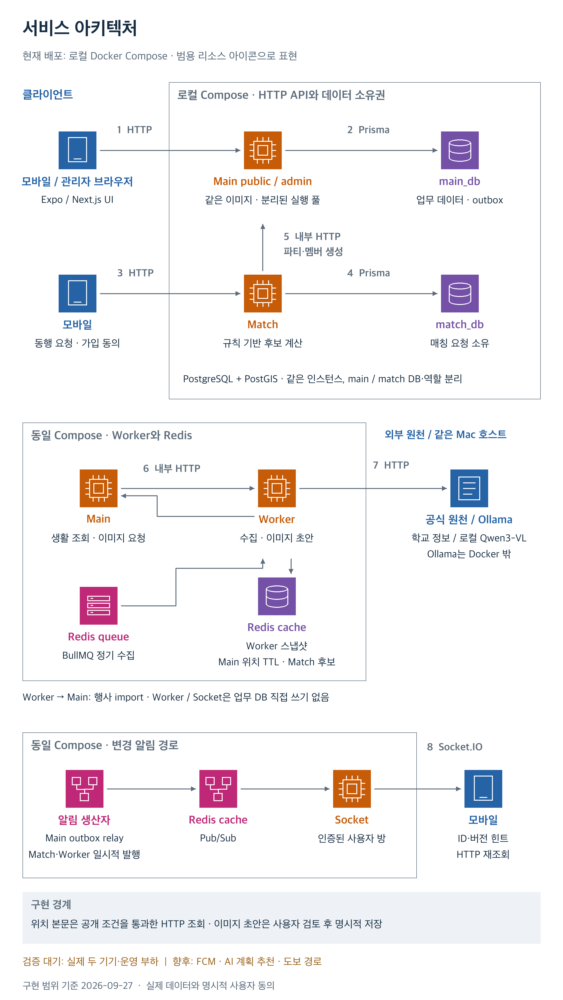
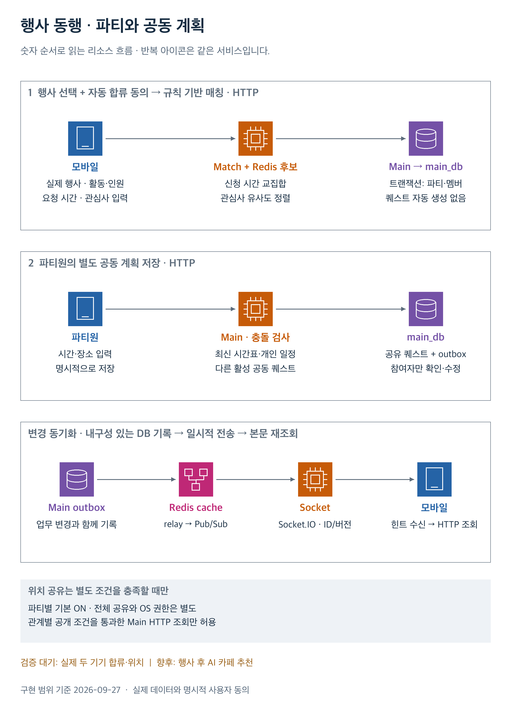
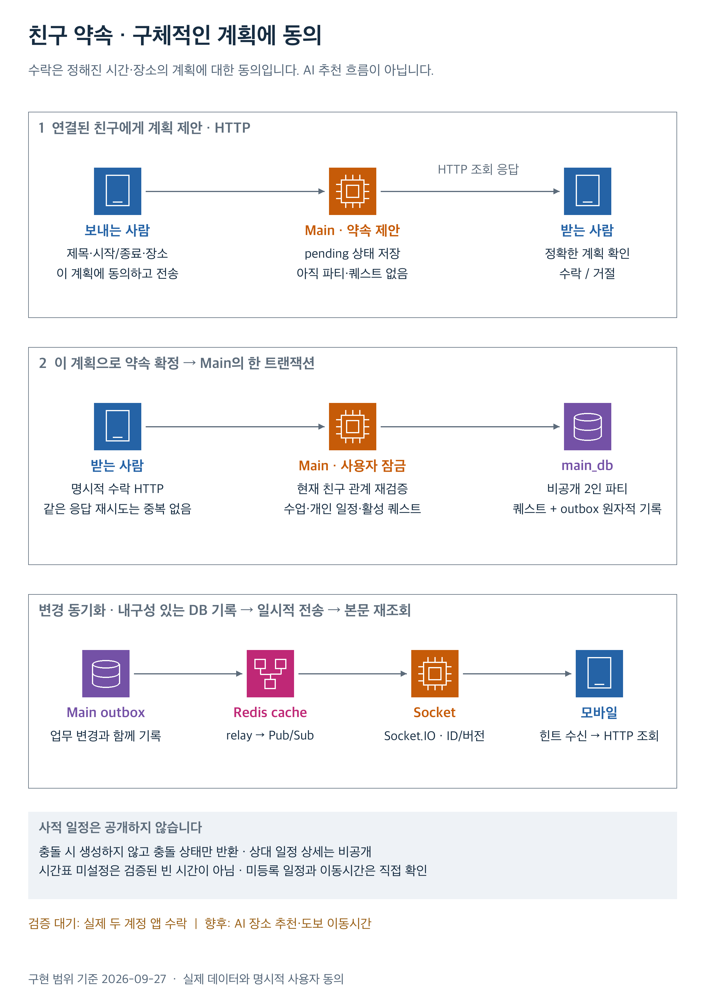
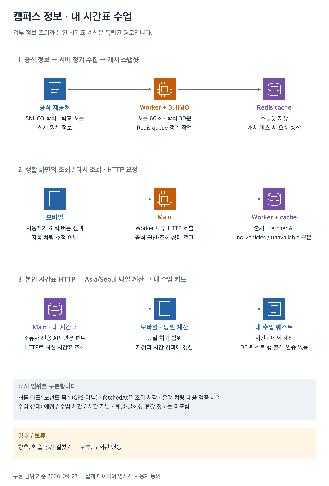

# 캠퍼스 프로토타입

서울대학교의 행사, 동행 파티, 친구 약속과 생활 정보를 연결하는 Android 프로토타입입니다. 제품 이름은 아직 정하지 않았습니다. 실제 학교 Google 계정과 실제 외부 데이터를 사용하며, 키가 없는 기능은 설정 필요 상태를 표시합니다.

## 구조와 데모 흐름

**2026-09-27 기준 코드 구조입니다.** 각 그림에서 현재 구현, 실제 기기 검증 대기, 향후·보류 범위를 구분합니다. 전체 MVP 완료를 뜻하지 않습니다.

그림은 **AWS 스타일의 범용 아이콘·서비스 그룹·번호가 붙은 연결선**으로 구성했으며, 실제 실행 환경은 **로컬 Docker Compose**입니다. 그림을 클릭하면 원본 크기로 볼 수 있습니다.

### 클라이언트·서버 구조

[](docs/diagrams/architecture.png)

- **클라이언트와 API:** 모바일은 main-public·match-server에, Next.js 어드민은 main-admin에 HTTP로 요청합니다. main-public과 main-admin은 같은 이미지·DB를 사용하면서 실행 자원과 라우트를 분리합니다.
- **데이터 소유권:** main과 match는 각자의 Prisma schema·migration·DB를 소유합니다. match의 파티 확정과 worker의 행사 반영은 main 내부 API를 거칩니다.
- **실시간 갱신:** Socket.IO는 변경 ID·버전의 힌트를 전달하고 앱이 HTTP로 최신 상태를 다시 읽습니다. main은 업무 변경과 outbox를 함께 저장합니다. match·worker의 직접 Pub/Sub 알림은 일시적이며, 재접속·주기적 재조회로 누락을 보완합니다.
- **부하 분산:** Redis cache는 조회 캐시·위치 TTL·매칭 후보 인덱스·Pub/Sub에, Redis queue는 worker의 BullMQ 수집 작업에 사용합니다. 로컬 Ollama는 이미지에서 검토용 초안을 추출하며 자동 저장하지 않습니다.

### 데모 1 · 행사에서 동행으로

[](docs/diagrams/demo-event.png)

1. 사용자가 행사를 보고 활동·신청 시간·인원과 **자동 합류 동의**를 제출합니다. match가 활동·행사·인원, 시간 교집합과 관심사로 그룹을 구성합니다.
2. main이 내부 요청을 멱등 처리해 파티와 회원을 확정합니다. **매칭 자체는 퀘스트를 만들지 않습니다.** 파티원이 공동 계획을 별도로 저장할 때 시간표·개인 일정·다른 공동 계획과 충돌을 검사하고 공유 퀘스트를 만듭니다.
3. 위치는 별도의 공유 동의와 OS 권한을 충족해야 표시합니다. 파티 합류만으로 GPS 공유가 켜지지는 않습니다.

현재 데모는 **규칙 기반 매칭**입니다. 선택적 임베딩 코드는 실제 AI 매칭 품질 검증과 구분합니다. 두 기기 합류·위치 시연은 검증 대기이며 행사 후 AI 카페 추천은 향후 범위입니다.

### 데모 2 · 친구와 구체적인 약속 합의

[](docs/diagrams/demo-friends.png)

1. 친구에게 제목·시작/종료 시각·장소가 정해진 계획을 보냅니다. 상대는 **그 계획에 동의해 수락**합니다.
2. main은 수락 트랜잭션에서 최신 친구 관계와 두 사람의 시간표·개인 일정·활성 공동 퀘스트를 재확인합니다. 충돌이 없으면 비공개 2인 파티와 퀘스트를 한 번만 생성합니다.
3. 두 사람은 변경 알림을 받은 뒤 HTTP로 결과를 읽습니다. 상대의 수업명·개인 일정 내용은 공개하지 않으며, 미설정 시간표를 빈 시간으로 간주하지 않습니다.

두 계정의 앱 수락 시연은 검증 대기이며 **AI 장소 추천·도보 이동시간 반영**은 향후 범위입니다.

### 데모 3 · 오늘의 캠퍼스 생활

[](docs/diagrams/demo-campus.png)

- **생활 정보:** worker가 실제 학식·셔틀 정보를 주기적으로 수집해 Redis에 저장합니다. 생활 화면에서 조회하면 main이 스냅샷을 받아 출처·조회 시각과 함께 반환합니다. 셔틀 좌표는 GPS가 아닌 **노선도 좌표**이며 차량 없는 응답도 그대로 표시합니다.
- **오늘의 수업:** 본인 시간표와 서울 날짜로 모바일에서 기본 퀘스트를 계산합니다. 수업마다 DB 퀘스트를 생성하지 않으며, 시간에 따른 상태 표시는 출석 인증이 아닙니다.

운행 중 차량·정류장 대응은 검증 대기입니다. 학습 공간·길찾기는 향후 범위이며 도서관 연동은 보류입니다.

[그림 수정·재생성](docs/diagrams/README.md) · [연결별 코드 근거](docs/diagrams/content-notes.md)

## 구성

| 프로젝트 | 역할 | 로컬 포트 |
| --- | --- | --- |
| `mobile/` | React Native / Expo Android 앱 | Metro 8081 |
| `admin-frontend/` | Next.js 팀원용 행사 관리 | 3100 |
| `main-server/` | 계정·행사·친구·파티·퀘스트·위치 권한 | public 3000 / admin 3001 |
| `socket-server/` | 인증된 사용자에게 변경 알림 | 3002 |
| `worker-server/` | 실제 행사·학식·셔틀 수집, 로컬 이미지 추출 | 내부 3003 |
| `match-server/` | 동의한 요청의 후보 계산·매칭 | 3004 |

각 프로젝트에서 독립적으로 `pnpm install --frozen-lockfile`을 실행합니다. 루트 package.json이나 workspace는 없습니다. main-public과 main-admin은 같은 소스·이미지·DB를 사용하며 실행 자원과 HTTP 라우트를 분리합니다. PostgreSQL은 서비스별 DB·역할을 나누고, main/match는 각각 Prisma 7.10.0 schema와 migration을 소유합니다. Redis는 캐시와 BullMQ 큐를 별도 컨테이너로 실행합니다.

## 서버 실행

루트 `docker-compose.yml`을 Compose 기본 탐색으로 사용합니다. 아래 명령은 저장소 루트에서 실행합니다. Node.js 22, pnpm 10, Docker 호환 엔진과 Compose가 필요합니다. macOS에서는 Colima 또는 Docker Desktop을 사용할 수 있습니다. `.env.prototype.example`을 **파일이 없는 경우에만** `.env.prototype.local`로 복사합니다. 다섯 로컬 비밀 값(`POSTGRES_PASSWORD`, `DB_MAIN_PASSWORD`, `DB_MATCH_PASSWORD`, `JWT_SECRET`, `INTERNAL_API_KEY`)은 각각 `openssl rand -hex 32`로 생성합니다. 실제 값은 커밋하거나 채팅에 붙이지 않습니다.

```sh
docker compose --env-file .env.prototype.local up --build -d
docker compose --env-file .env.prototype.local ps
```

새 DB에는 시작 시 Prisma migration을 적용합니다. Prisma 도입 이전 DB가 있다면 먼저 백업·스키마 비교 후 명시적으로 baseline을 등록해야 합니다. [main-server 절차](main-server/README.md), [match-server 절차](match-server/README.md)를 따르며 기존 데이터를 reset하지 않습니다. 현재 로컬 DB는 이 검증과 전환을 완료했습니다.

어드민은 <http://localhost:3100>, 메인 API 상태는 <http://localhost:3000/health>입니다. DB와 Redis 포트는 로컬 루프백에만 노출됩니다. 모바일 접속을 위해 public/socket/match 포트는 로컬 네트워크에서 접근할 수 있습니다. 이 Compose는 개발용이며 인터넷 공개 배포용 보안/TLS 설정은 포함하지 않습니다.

공식 PostGIS 컨테이너가 amd64 이미지이므로 Apple Silicon에서는 에뮬레이션을 사용합니다. DB 볼륨은 중지 후에도 남으며 비밀번호 변경만으로 기존 DB 계정이 갱신되지는 않습니다. `down -v`는 데이터를 지우므로 일반 재시작에 사용하지 않습니다.

## Colima로 실행하기

Colima도 같은 Compose 파일을 사용할 수 있습니다. macOS Apple Silicon에서는 공식 PostGIS amd64 이미지를 위해 Rosetta를 지원하는 VZ VM을 선택합니다. Docker Desktop과 Colima는 이미지·볼륨을 별도로 보관하므로 전환 시 DB가 자동으로 옮겨지지는 않습니다. 같은 포트를 쓰는 이 프로젝트를 두 엔진에서 동시에 실행하지 않습니다.

```sh
brew install colima docker docker-compose
colima start --vm-type=vz --vz-rosetta --cpu 4 --memory 8 --disk 40
docker --context colima compose --env-file .env.prototype.local up --build -d
```

`docker compose` 플러그인을 찾지 못하면 `brew info docker-compose`의 설치 안내를 확인합니다. 이미 Docker Desktop에서 이 프로젝트를 실행했다면 먼저 해당 엔진에서 이 프로젝트만 중지하고 전환합니다. Rosetta/VZ는 지원되는 macOS에서 사용합니다. 이 명령을 문서화한 것과 Colima에서 실제 검증을 완료한 것은 구분합니다.

[Colima 공식 안내](https://github.com/abiosoft/colima), [Docker Desktop 교육용 무료 사용 조건](https://docs.docker.com/subscription-billing/desktop-license/)

## 현재 검증 상태 (2026-09-27)

- Compose 컨테이너 9개가 실행 중이며 main-public/main-admin은 같은 Prisma 기반 이미지와 DB를 사용합니다. 별도 main/match 데이터 소유권과 기존 데이터를 보존했습니다.
- 실제 학교 Google 로그인, Naver 캠퍼스 지도, 프로필·시간표·친구 약속 목록·개인 일정 화면을 에뮬레이터에서 확인했습니다. 실제 두 계정 간 앱 시연과 백그라운드 위치·이동·배터리 검증은 남아 있습니다.
- 친구에게 구체적인 계획을 제안하고 수락·거절·취소할 수 있습니다. 수락 시 비공개 2인 파티·퀘스트를 한 번만 생성하며 최신 수업·약속·개인 일정 충돌을 재검증합니다. 개인 일정은 소유자만 편집하고, 저장 충돌에서는 작성 내용을 보존합니다.
- 시간표·개인 일정에서 사진을 선택하면 native Ollama/Qwen3-VL이 초안을 반환합니다. 원본 확대 비교 후 명시적으로 저장하며 원본 이미지는 서버에 보관하지 않습니다. 현재는 로컬 개발 연결만 허용합니다. Android 에뮬레이터의 기본 사진 선택기 멈춤에 대비한 **파일에서 사진 선택** 경로로 실제 추출·편집 가능한 초안·원본 확대를 확인했습니다. [기기 검증](.scratch/local-image-extraction/android-verification.md), [실측 결과와 알려진 오독](.scratch/local-image-extraction/evaluation.md), [모델 실행 설정](worker-server/README.md#local-image-extraction).
- 등록한 시간표에서 서울 기준 당일 수업을 기본 퀘스트로 계산합니다. 수업마다 DB 퀘스트를 생성하지 않으며 시간표 수정은 본인 전용 소켓 알림으로 갱신합니다. 수업 상태는 시간 기준이고 출석·완료 인증을 의미하지 않습니다.
- Main51·mobile44·Worker12·Socket5 검사, 서버/모바일 빌드와 서비스간 HTTP/Socket E2E를 통과했습니다. 권한 격리, 동시 수락·저장 충돌, 소유자 전용 알림, 매칭 중복 방지, 캐시 갱신 및 DB 연결 복구를 확인했습니다. 합성 테스트 계정은 임시 DB에만 생성했습니다.
- 실제 학식 조회와 공식 행사 수집 경로가 연결되었습니다. 불완전한 공지는 제외하고 셔틀의 차량 없는 응답을 그대로 표시합니다. 운행 중 실제 차량/정류장 대응 검증은 남았습니다.
- Redis 행사 목록을 실제 `pg_stat_statements`로 측정했습니다. 강제 cache miss50회와 warm50회에서 행사 SELECT는50→0, 인증 SELECT는50→50이었습니다. 이는 단일 로컬 순차 표본이며 [측정 방법·한계](.scratch/cache-measurement/report.md)에 범위를 기록했습니다.
- 추가 migration 전에 DB를 백업했고 기존11개 업무 테이블의 모든 행이 유지됨을 확인했습니다. Colima 실행 방법은 제공하지만 이번 실행은 기존 Docker Desktop에서 검증했습니다.

서버 4개를 각 디렉터리에서 빌드하고 모바일 의존성을 설치한 뒤, Compose DB/Redis가 실행 중일 때 통합 검사를 재현할 수 있습니다.

```sh
node tests/prototype-e2e.mjs
```

이 검사는 로컬 설정을 읽고 임시 DB·빈 Redis 테스트 인덱스 14/15·13900~13904 포트를 사용합니다. 기존 데이터가 있는 테스트 인덱스는 거부하고 자신이 만든 리소스만 정리합니다. 테스트 계정은 실제 로그인 우회에 사용되지 않습니다.

현재 APK는 전체 MVP 완료가 아닙니다. 로컬 시간표/포스터 이미지 추출과 원본 비교·수정 화면은 구현했지만2B 모델의 시각·문자 오류가 있어 품질 개선이 남았습니다. AI 대화형 명령, 일정·이동시간을 고려한 추천, FCM 실제 발송, 비공개 구역, 대표 운영 부하 시험 등도 개발 목록에 남아 있습니다. 공동 퀘스트는 함께 합의한 활동 계획이며 단계별 완료/체크인을 임의로 추가하지 않습니다.

## Google·지도·AI 설정

1. Google Cloud 프로젝트에 Web OAuth client를 만들고 `GOOGLE_WEB_CLIENT_ID`에 넣습니다. 어드민 Web client의 허용 JavaScript origin은 `http://localhost:3100`입니다. 서버는 같은 audience의 ID token을 검증합니다.
2. 학교 계정의 `email_verified`, 정확한 `snu.ac.kr` 도메인과 `hd`를 검증합니다. 학교 Google 계정 확인은 재학 증명이나 학교 SSO 연동과 다릅니다.
3. 팀원 학교 이메일을 `ADMIN_EMAILS`에 쉼표로 구분해 넣습니다. 비어 있으면 누구에게도 관리자 권한을 주지 않습니다.
4. Android OAuth client는 앱 package와 실제 APK 서명 SHA-1을 등록합니다. 기존 Web client는 유지합니다. 모바일의 `EXPO_PUBLIC_GOOGLE_WEB_CLIENT_ID`에는 같은 Web client ID를 넣으며, Android client는 네이티브 SDK가 package/서명으로 선택합니다.
5. 지도는 네이버 네이티브 SDK를 사용합니다. Naver Cloud Maps 애플리케이션에서 Dynamic Map 및 Android package `kr.ac.campus.prototype`을 등록하고 Client ID를 `mobile/.env.local`의 `NAVER_MAP_CLIENT_ID`에 넣습니다. Client Secret은 앱에 넣지 않습니다. 모바일 설정 변경 후 네이티브 앱을 다시 빌드합니다. Google Maps 설정은 필요 없습니다. 어드민 Web ID 변경 때만 Next.js 이미지도 다시 빌드합니다.
6. `OPENAI_API_KEY`가 있으면 매칭 임베딩 경로를 사용할 수 있습니다. 없으면 규칙 기반임을 표시합니다. 호출 비용이 발생할 수 있으며 임베딩을 동행 궁합 확률로 해석하지 않습니다.

학교 로그인과 지도 검증에는 사용자 소유의 OAuth/Maps 설정이 필요합니다. 사용자는 향후 인증이 개발을 막을 때 명시적으로 켠 개발 환경의 테스트 세션을 허용했습니다. 현재 전달 APK는 실제 Google 로그인을 사용하며 개발 세션을 학교 인증 성공의 증거로 보고하지 않습니다.

## Android 개발

`mobile/.env.local`이 없을 때만 예시 파일에서 생성합니다. 현재 로컬 테스트는 API·Socket·Match를 `http://127.0.0.1:3000`, `:3002`, `:3004`로 설정하고 USB 디버깅의 `adb reverse`로 Mac에 연결합니다. 에뮬레이터도 같은 방식을 쓸 수 있습니다. `PROTOTYPE_LOCAL_HTTP=true`일 때만 생성하는 Android 네트워크 설정은 루프백/에뮬레이터 주소에만 HTTP를 허용합니다. 일반 LAN 주소는 이 예외에 포함하지 않습니다. 외부 배포와 백그라운드 공유에는 HTTPS/WSS가 필요합니다.

```sh
adb reverse tcp:3000 tcp:3000
adb reverse tcp:3002 tcp:3002
adb reverse tcp:3004 tcp:3004
```

기기가 여러 개면 각 명령에 `adb -s <기기 ID>`를 사용합니다. 연결을 해제하거나 재부팅한 뒤에는 다시 설정합니다.

```sh
cd mobile
pnpm install --frozen-lockfile
pnpm android
```

개발 빌드는 Metro 서버가 필요합니다. 별도 Metro 없이 실행되는 ARM64 테스트 APK도 아래 명령으로 빌드했습니다. JDK 21과 Android SDK 경로를 먼저 설정합니다.

```sh
pnpm exec expo prebuild --platform android --no-install
cd android
NODE_ENV=production ./gradlew assembleRelease --no-daemon -PreactNativeArchitectures=arm64-v8a
```

결과는 `mobile/android/app/build/outputs/apk/release/app-release.apk`입니다. 이번 파일은 루트 `artifacts/prototype-arm64.apk`에도 저장했으며 Git에는 포함하지 않습니다. JavaScript 번들을 내장했고, Expo가 생성한 **개발용 서명**을 사용하므로 스토어 배포용 서명이 아닙니다. 빌드 시점의 `.env.local` 설정이 반영됩니다. 키가 빠진 기능은 설정 필요 상태로 표시하며, APK 생성 성공만으로 실제 로그인·지도·위치 검증이 완료된 것은 아닙니다.

- Android package: `kr.ac.campus.prototype`
- 이번 테스트 서명 SHA-1: `5E:8F:16:06:2E:A3:CD:2C:4A:0D:54:78:76:BA:A6:F3:8C:AB:F6:25`
- 다른 키로 서명하면 새 SHA-1을 Google OAuth에 등록합니다. 네이버 Maps는 등록된 Android package를 확인합니다. 위치 공유는 사용자 스위치와 OS 권한이 모두 필요하며 화면을 끈 실제 Android에서 별도로 확인해야 합니다.

## 데이터와 공개 범위

- 행사: 팀원이 직접 생성한 실제 행사와 날짜·장소가 확인되는 공식 학교 공지. 불완전한 원문은 임의 보충하지 않습니다.
- 학식: SNUCO의 요청 날짜 HTML. 공란·휴무·조회 실패를 구분합니다.
- 순환 셔틀: 학교에서 안내한 busin 노선 41946/41914. 좌표는 **정류장 노선도의 픽셀**이며 GPS가 아닙니다. 빈 차량 응답을 움직이는 샘플 차량으로 채우지 않습니다.
- 관정 좌석·예약은 초기 버전에서 보류합니다.
- 파티 공유는 기본 ON이지만 OS 권한이나 전체 공유를 자동으로 켜지는 않습니다. 파티 OFF여도 서로 공유 중인 친구와는 공유가 유지됩니다. 친구 OFF와 파티 ON 등 남은 충돌 조합은 보수적으로 차단합니다.
- 테스트용 사용자는 자동 검증에만 사용하며 실제 로그인·외부 데이터 성공으로 보고하지 않습니다.

설계와 endpoint는 [API 계약](docs/prototype-api.md), 이전 결정과 조사 근거는 [.scratch/architecture-planning](.scratch/architecture-planning)에서 확인할 수 있습니다. 재시도·이벤트 버전·권한 검사를 적용하더라도 성능 개선 수치는 실측 전까지 주장하지 않습니다.
